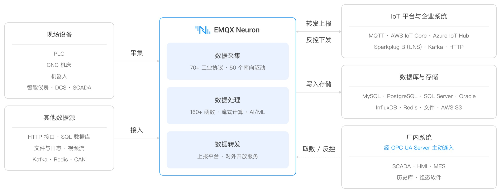

# 产品概览

EMQX Neuron 是一款工业边缘网关软件，部署在制造、能源、楼宇等工业现场。设备侧协议繁杂、数据格式不统一，而 MES、SCADA 和云平台需要标准化的实时数据——EMQX Neuron 把 PLC、CNC、机器人、仪表等 OT 设备的数据采集上来，在边缘完成清洗和计算，再按上层系统需要的形式交付。

## 核心能力

| 
能力
 | 说明 | 
详见
 |
| --- | --- | --- |
| **数据采集** | 通过南向驱动接入 70+ 工业协议，覆盖 Modbus、OPC UA、EtherNet/IP、IEC 60870、BACnet、西门子与三菱 PLC、各类 CNC | [南向驱动](./introduction/driver-list/driver-list.md) |
| **数据处理** | 内置流式计算引擎，160+ 函数支持过滤、转换、聚合与时间窗口计算；可集成 Python / C++ 自定义函数和 AI/ML 模型 | [数据处理](./streaming-processing/overview.md) |
| **数据转发** | 上报到 IoT 平台与企业系统、写入数据库，或在现场以 OPC UA Server 对外开放数据 | [北向应用](./configuration/north-apps/catalog.md) |
| **运维管理** | Web 控制台完成配置、用户与权限、日志下载、运行监控与告警，支持主备部署 | [运维](./admin/introduction.md) |

## 快速上手

- **先验证一条完整链路** —— [快速入门](./quick-start/quick-start.md)，用 Docker 起一个实例，从模拟设备采集数据并转发到 MQTT。
- **要装到生产环境** —— [安装与部署](./installation/introduction.md)，支持 tar.gz、rpm、deb、Docker，以及主备部署。
- **先确认设备协议支不支持** —— [南向驱动](./introduction/driver-list/driver-list.md)，按协议和 CNC 型号查对照表。
- **想了解内部怎么组成** —— [架构](./introduction/architecture.md)。

## 数据去向

如上图所示，采集与处理后的数据有四个去向：

| 
去向
 | 方式 | 说明 |
| --- | --- | --- |
| 推到 IoT 平台 | [MQTT](./configuration/north-apps/mqtt/overview.md)、[AWS IoT Core](./configuration/north-apps/aws-iot/overview.md)、[Azure IoT Hub](./configuration/north-apps/azure-iot/overview.md)、[Sparkplug B](./configuration/north-apps/sparkplugb/overview.md) | **双向**：上报点位值，也可由平台下发写入指令反控设备。Sparkplug B 用于构建 UNS 统一命名空间，文档提供 [Ignition](./configuration/north-apps/sparkplugb/ignition.md)、[Cogent DataHub](./configuration/north-apps/sparkplugb/cogent.md) 的实测连接示例 |
| 推到企业系统 | [Kafka](./configuration/north-apps/kafka/overview.md)、HTTP、[WebSocket](./configuration/north-apps/websocket/websocket.md) | 写入企业消息总线，供 MES、数据中台消费 |
| 写入数据库与存储 | MySQL、PostgreSQL、SQL Server、Oracle、InfluxDB、Redis、AWS S3 | 由数据处理的 [Sink](./streaming-processing/sink/sink.md) 写出，可先聚合降采样再落库 |
| 在现场对外开放 | [OPC UA Server](./configuration/north-apps/opcua-server/overview.md) | 厂内 SCADA、HMI、MES、历史库作为客户端连入取数，也可下发控制指令 |

### 在现场对外开放 OPC UA 服务

前三种由 EMQX Neuron 主动上报数据，[OPC UA Server](./configuration/north-apps/opcua-server/overview.md) 是反过来的一条通道：EMQX Neuron 以 OPC UA 标准对外提供服务，厂内既有的 SCADA、HMI、MES 和历史库作为客户端直接连上来，订阅点位变化、读取实时值，也可以反向下发控制指令。

对已经建成的产线，价值在于**不用改造上位机系统**——SCADA 原生支持 OPC UA，接入之后，南向接入的七十多种设备协议统一成一个 OPC UA 数据源，原本各说各话的 Modbus、西门子 S7、三菱、CNC 设备不再需要逐个对接。安全方面支持 Basic256Sha256 等安全策略、用户名密码认证，以及服务端证书与受信任客户端证书的双向校验。

## 部署与性能

- **低延迟**：采集周期最快 100 毫秒，数据在边缘侧完成处理，不必往返云端。
- **部署轻量**：内存占用低，支持 x86 与 ARM，可运行在工控机、网关设备上，也支持 Docker 与 Kubernetes 部署。
