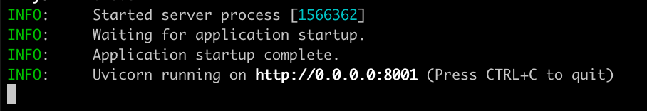

# NeuronEX AI 功能安装包安装指南

1. 根据当前环境, 下载对应的安装包, 例如: neuronex-3.6.0-beta.3-linux-amd64.deb
2. 参考文档安装 NeuronEX: [安装 NeuronEX](./introduction.md)
3. 进入 AI 功能模块目录, systemd 托管的 NeuronEX 的 AI 功能默认目录是: /opt/neuronex/software/neuronex-ai
4. NeuronEX 的 AI 功能采用 uv 作为项目管理工具, 如果没有 uv, 需要先安装, 具体参考: [Installing uv](https://docs.astral.sh/uv/getting-started/installation/)
5. uv 安装成功后, 使用如下命令测试 AI 功能是否能正常启动: uv sync &&  cd src/apps_entry && uv run main.py
6. 如果上面的命令出现如下提示, 则表示 AI 相关依赖库已安装成功:

7. 如果所处环境无法正常安装 uv 和依赖库, 可以寻找可用的国内镜像库, 或者使用 NeuronEX 带 -ai 或者 -ai-arm64 后缀的容器镜像来部署 NeuronEX 服务, 镜像中已经有完整的 AI 功能. 