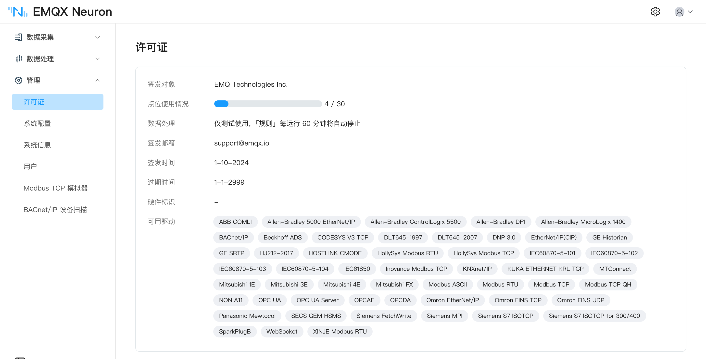
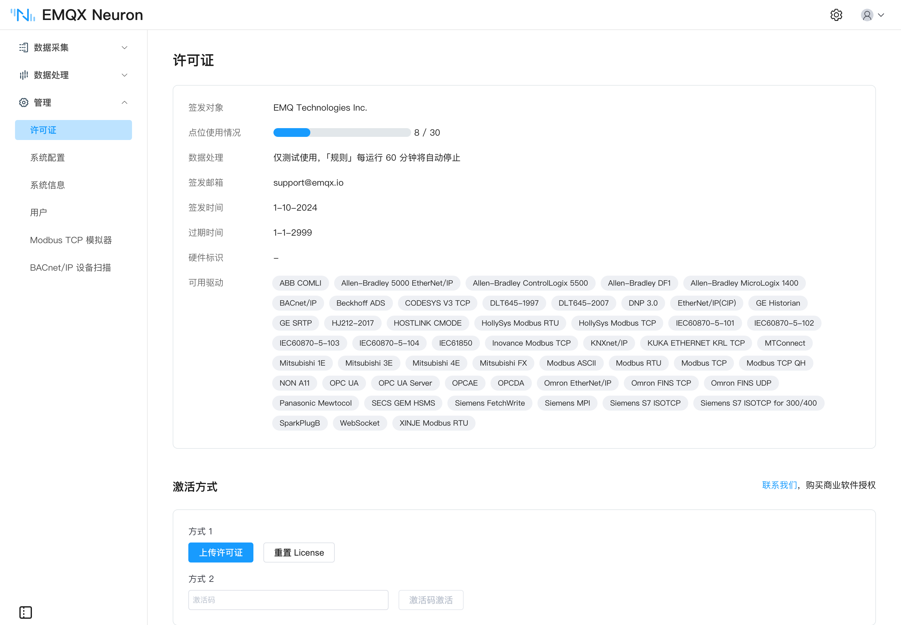

# 许可证

EMQX Neuron 安装后即可使用：默认包含一份**永久免费**的许可证，含 30 个数据点位。超出这个额度，或者需要完整的数据处理能力，才需要申请试用或商业许可证。

## 额度对比

| 
项目
 | 免费（默认自带） | 试用 | 商业 |
| --- | --- | --- | --- |
| 数据点位 | 30 个 | 1000 个 | 按订购 |
| 有效期 | 永久 | 15 天 | 按订购期限 |
| 数据处理 | 仅供测试，**规则每运行 60 分钟自动停止** | 完整可用 | 完整可用 |
| CNC 驱动 | 不含 | 含 | 含 |
| 硬件绑定 | 不涉及 | 默认需要绑定硬件标识 | 绑定或不绑定均可 |
| 申请方式 | 无需申请 | [官网申请](https://www.emqx.com/zh/contact?product=neuronex)，同一邮箱最多两次 | [联系 EMQ 商务](https://www.emqx.com/zh/contact?product=neuronex) |

EMQX Neuron 软件本身可从 [EMQ 官网](https://www.emqx.com/zh/try?product=neuronex)直接下载，不需要许可证。

## 免费额度包含什么

默认许可证覆盖大部分标准南向驱动与北向应用——Modbus、OPC UA、西门子与三菱 PLC、EtherNet/IP、IEC 60870、IEC 61850、BACnet、DL/T645、MQTT、Sparkplug B 等，都可以在 30 点位以内直接使用，无需付费。

::: tip 注意
Fanuc Focas Ethernet、Mitsubishi CNC 等 **CNC 驱动不在永久免费范围内**。如需使用，请[联系我们](https://www.emqx.com/zh/contact?product=neuronex)。
:::

驱动与应用是**逐个独立授权**的，你这套实例实际被授权了哪些，以 **管理 → 许可证** 页面的「可用驱动与应用」为准。支持的协议全集见[南向驱动](../introduction/driver-list/driver-list.md)。

## 申请试用许可证

在 [EMQ 官网](https://www.emqx.com/zh/contact?product=neuronex)申请，可在 1000 个数据点位下完整试用所有驱动、应用和数据处理功能，有效期 15 天。过期后可以重新申请，同一邮箱最多申请两次。

::: tip
官网申请的试用许可证**必须绑定硬件标识**。Docker 等容器方式安装的 EMQX Neuron 硬件标识为空，无法绑定——这种情况请[联系我们](https://www.emqx.com/zh/contact?product=neuronex)申请免绑定的许可证。
:::

## 安装许可证

许可证可以多次安装，新的会覆盖旧的。有三种方式：

| 
方式
 | 适用场景 |
| --- | --- |
| [上传许可证文件](#上传许可证文件) | 单台部署，最常见 |
| [激活码激活](#激活码激活) | 批量网关，一个订单号下发多个许可证 |
| [ECP 浮动许可证](#ecp-浮动许可证) | 多套实例，由 ECP 统一分配点位 |

### 上传许可证文件

[联系我们](https://www.emqx.com/zh/contact?product=neuronex)申请许可证后，进入 **管理 → 许可证** 页面，点击 `上传许可证`。上传成功后即可在该页面看到许可证详情。

### 激活码激活

适用于在大批量网关硬件上部署 EMQX Neuron 的场景，通过激活码完成许可证的分发与硬件绑定。

1. 与 EMQ 商务沟通，批量购买许可证。下单完成后，EMQ 会把订单号发到指定邮箱。一个订单号可包含多个同规格许可证，每个许可证激活一个 EMQX Neuron 实例。

2. 打开 [EMQX Neuron 许可证信息查询](https://www.emqx.com/zh/neuronex-license-info)页面，输入订单号、绑定邮箱和验证码，查到订单信息和激活码后保存下来。

   

3. 进入 EMQX Neuron 的 **管理 → 许可证** 页面，填入激活码，点击 `激活码激活`。EMQX Neuron 会从官网获取许可证并自动导入。

   

激活成功后，再回到许可证信息查询页面，该订单的剩余数量会减一。

::: tip
- 激活码方式需要 EMQX Neuron 所在网络能访问 EMQ 官网。
- 硬件设备丢失许可证后，可以用同一个激活码重新下发。许可证与硬件标识一一对应，同一设备多次激活只扣减一个名额。
:::

### ECP 浮动许可证

适用于由 ECP 纳管的 EMQX Neuron。需要部署多套实例时，ECP 可以统一管理点位总数并灵活分配，同时提供快速部署、远程操作和集中管理能力。详见 [ECP](https://www.emqx.com/zh/products/emqx-ecp)。

## 查看许可证信息

无论用哪种方式安装，都可以在 **管理 → 许可证** 页面查看：

| 
字段
 | 说明 |
| --- | --- |
| 签发时间 | 许可证生效的时间 |
| 过期时间 | 可使用的截止日期 |
| 点位数 | 可使用的最大点位数，以及当前已用数量 |
| 可用驱动与应用 | 已授权的驱动与应用。每个商业驱动或应用都在许可证中独立授权 |
| 硬件标识 | 当前运行实例的硬件标识，见下文 |

## 硬件标识

许可证分为**绑定硬件**和**不绑定硬件**两种。绑定型许可证只在硬件标识匹配的实例上生效，硬件标识可在许可证页面查看。

::: tip
Docker 等容器方式安装的 EMQX Neuron 硬件标识为空，无法使用绑定型许可证。
:::

## 过期与更换

许可证过期后，EMQX Neuron 的核心功能停止运行：数据采集与转发中断，且不会自动退回默认的免费许可证。

控制台仍可登录。上传新的许可证文件或输入新的激活码即可恢复，方式与首次安装相同，新许可证会覆盖旧的，无需先卸载。暂时没有新许可证时，可以[重置为免费许可证](#重置为免费许可证)，在 30 个点位的额度内继续运行。

## 重置为免费许可证

在 **管理 → 许可证** 页面点击 `重置许可证`，即可恢复为默认的 30 点位永久免费许可证。
