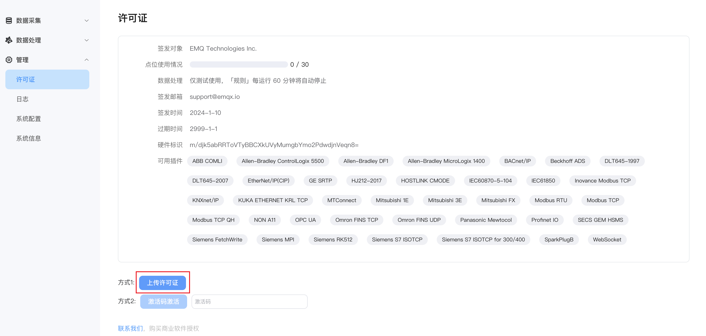
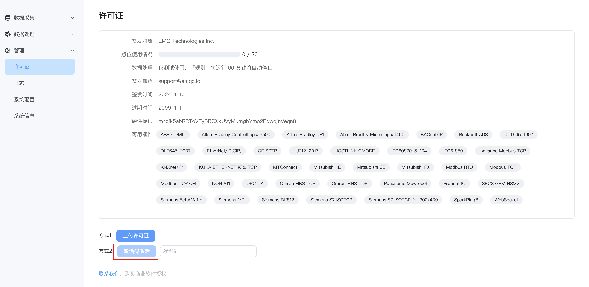

# 许可证政策

NeuronEX 提供了 30 个点（30 个数据标签）的免费额度。您可在不安装 EMQ 许可证的情况下，运行这些商业模块。超出免费额度，或者需要使用数据处理功能，则必须安装有效的试用版或官方 EMQ 许可证。

NeuronEX 的功能受许可证的限制，请在许可证有效期前更换合适的许可证，以避免影响您的功能使用。

## 安装许可证

许可证可以多次安装，重新安装后，旧的许可证将会被删除，安装许可证有以下3种方式：

### 许可证

  您可直接[联系我们](https://www.emqx.com/zh/contact?product=neuronex)申请 NeuronEX 的许可证，申请许可证后，可以在进入 NeuronEX 后，点击**管理** ->  **许可证**页面，点击`上传许可证`，上传成功后，即可在该页面看到该许可证的详细信息。

  

### 激活码

  这种方式适用于希望在网关硬件中安装 NeuronEX，并且能对大批量的网关硬件快速注册许可证的用户，需要通过注册激活码来手动激活 NeuronEX，实现许可证的分发与硬件绑定。

  - 用户与 EMQ 商务沟通，购买批量 NeuronEX 许可证，完成订单后，EMQ 将订单号发送到客户指定邮箱。一个订单号可包含同一规格的多个 NeuronEX 许可证，每个许可证可激活一个 NeuronEX 软件实例。

  - 用户进入到[NeuronEX许可证信息查询](https://www.emqx.com/zh/neuronex-license-info)页面,输入订单号，订单号绑定的邮箱及验证码，可以查询到当前购买的许可证订单信息以及激活码信息，保存激活码信息。

    

  - 进入NeuronEX后，点击**管理** ->  **许可证**页面，输入刚保存的激活码，点击`激活码激活`， NeuronEX 将从官网获得许可证，并自动导入。激活成功后，重新进入[ NeuronEX 许可证信息查询](https://site.mqttce.com/zh/neuronex-license-info)页面,会发现该订单的剩余License数减少一。

    

   :::tip

   通过激活码激活 NeuronEX 的许可证，需要 NeuronEX 软件所在的网络能够连通 EMQ 官网。
   :::

   :::tip

  若硬件设备丢失许可证后，可通过注册激活码重新下发 license 到硬件设备。许可证与 NeuronEX 的硬件标识对应一一对应，同一个设备，多次激活，剩余 license 数只会减1。
   :::

### 浮动许可证

  这种方式适用于被 ECP 管理的 NeuronEX，在需要部署多套 NeuronEX 的场景下，ECP 可以统一管理 NeuronEX 的点位数，并为 NeuronEX 灵活分配。此外，ECP 还提供 NeuronEX 的快速部署、远程操作和集中管理等功能，详情请参考 [ECP](https://www.emqx.com/zh/products/emqx-ecp)。

## 查看许可证

无论哪种方式安装的许可证，都可以在许可证页面查看到具体的信息。

| 内容         | 描述                                                         |
| :----------- | :----------------------------------------------------------- |
| 签发时间     | NeuronEX License 生效的时间                             |
| 过期时间     | NeuronEX 可使用的截止日期，如果 License 过期，系统将无法正常工作，您必须重新获取新的有效的 License，重新上传 License。 |
| 点位数 | NeuronEX 可使用的最大点位数    |
| 可用插件     | NeuronEX 已授权的插件，每个商业插件模块都可以在 EMQ 许可证中独立授权。 |

