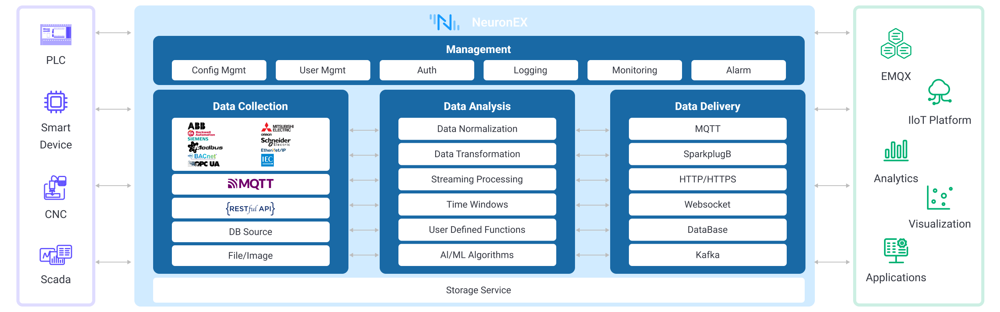

# NeuronEX 架构

NeuronEX 是一款面向工业领域的设备数据采集和边缘智能分析的软件，主要部署在工业现场，实现工业设备通信及工业总线协议采集、工业系统数据集成、边端数据过滤分析和AI算法集成，以及工业互联网平台对接集成等功能，为工业场景提供低延迟的数据接入管理及智能分析服务。

如上图所示，NeuronEX 主要分为`数据采集接入`、`数据处理分析`、`数据转发存储`以及`系统管理`等模块。

## 数据采集接入模块

在数据采集接入方面，NeuronEX 不仅支持**工业设备数据采集**，还支持工业现场**多源数据接入集成**。

### 工业设备数据采集

NeuronEX 通过插件的方式实现对各种工业协议的支持，包括 Modbus、OPC UA、EtherNet/IP、IEC104、BACnet、Siemens PLC、Mitsubishi PLC等。满足智能制造、石油石化、钢铁冶金、能源电力以及楼宇自动化等各个行业的数据采集接入需求。

### 多源数据接入集成
NeuronEX 还具备各类数据灵活获取的能力，在工业场景下，可以支持：

- MES、WMS、ERP系统对接
  
  [HTTP Pull](../streaming-processing/http_pull.md)及[HTTP Push](../streaming-processing/http_push.md)的方式与MES、WMS、ERP系统对接，进行数据的双向收发

- 数据库对接
  
  SQLite、MySQL、SQLserver等数据库数据获取

- 企业服务总线（ESB）对接
  
  [HTTP Pull](../streaming-processing/http_pull.md)及[HTTP Push](../streaming-processing/http_push.md)的方式双向对接企业服务总线，向企业服务总线推送数据以及接收数据
    
- [文件](../streaming-processing/file.md)数据采集

- 视频流接入分析

## 数据处理分析模块

NeuronEX 提供低延迟的数据处理分析，能够更快速地将数据在多系统间传递，结合 AI/ML 算法，可以实现智能决策与控制。此外，边缘端分析还可以对数据做预处理和边缘计算，减少云边通讯负载及后端存储压力。

NeuronEX 的数据处理分析模块可提供以下能力：

- 数据标准化
  
  NeuronEX支持对工业场景各类型设备的数据进行标准化，包括数据类型转换、数据单位转换、数据格式转换等，满足工业场景下数据标准化的需求。

- 数据过滤清洗

  NeuronEX 内置数据抽取、转换、过滤、排序、分组、聚合、连接等功能，内置 160+ 各类函数，覆盖数学运算、字符串处理、聚合运算和哈希运算等，可满足各种数据过滤清洗的需求。

- 实时数据流处理
  
  NeuronEX 提供了对数据流实时低延迟处理的能力，支持工业场景下多系统之间的数据实时交互、协同处理，实现全域的互联互通及智能决策。

- AI/ML 算法集成
    
  NeuronEX 支持用户自定义函数扩展和 AI 算法集成，提供智能数据分析能力。

## 数据转发存储模块

NeuronEX 支持将数据转发到云平台或外部系统，实现数据的传递，支持MQTT、SparkplugB、HTTP、Websocket等数据传递方式，也支持将数据存储到数据库中。

## 系统管理模块

NeuronEX 系统管理模块包含系统配置、认证、日志、监控告警等功能。
如何使用NeuronEX 系统管理模块，请参考 [运维指南](../admin/introduction.md)。