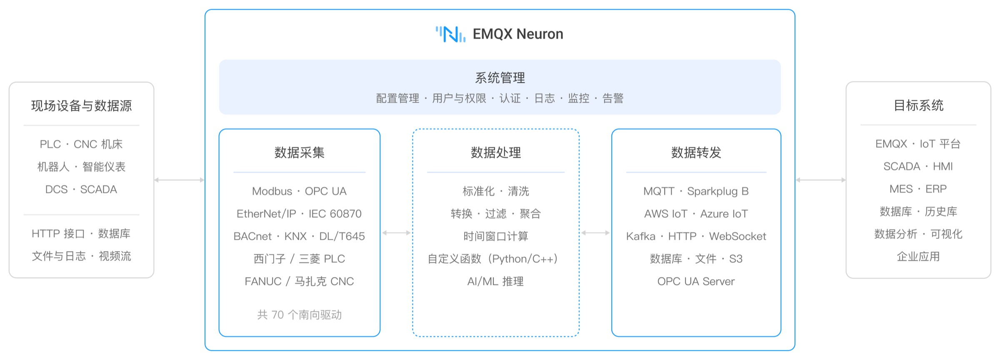

# 架构

EMQX Neuron 运行在工业现场：南向驱动按协议读写设备，北向应用将数据上报至外部系统，中间由独立的流式计算引擎做处理，整体由系统管理模块统一配置和监控。

## 核心数据模型

理解 EMQX Neuron 的配置，先理解这三层：

| 概念 | 是什么 |
| --- | --- |
| **节点 (Node)** | 一个南向驱动或北向应用的运行实例。同一种驱动可以建多个节点，分别连不同设备 |
| **组 (Group)** | 节点下的采集单元，有独立的采集频率。**组是采集、上报和订阅的最小粒度** |
| **点位 (Tag)** | 设备里的一个地址，带读写属性、数据类型和精度 |

一个 EMQX Neuron 进程里可以同时运行多个南向和北向节点，彼此隔离，由核心框架负责它们之间的消息路由。

详细配置见[数据采集、处理与转发](../configuration/introduction.md)，名称长度、单节点组数、最快采集周期等限制见该页的[配置规范](../configuration/introduction.md#配置规范)。

## 南向到北向的数据路由

南向采到的数据不是直接交给北向应用的，而是经核心框架的消息总线转发：

1. 每个节点在启动时建立两条 UNIX 域套接字（`AF_UNIX` / `SOCK_DGRAM`）——一条走控制指令，一条走数据，控制面和数据面分开。
2. 北向应用按 **(驱动, 组)** 建立订阅，订阅关系记录在核心框架里，同时记下该应用的套接字地址。
3. 某个组采集完成后，核心框架查出订阅了这个组的所有应用，把数据投递到各自的数据面套接字。

因为订阅按组、不按节点，所以同一个南向设备的不同组可以分发给不同的北向应用——比如高频组只发给本地 SCADA，低频组才上云。订阅操作见[订阅南向数据](../configuration/subscription.md)。

## 数据处理引擎

流式计算引擎是**独立进程**，不在 EMQX Neuron 主进程内，两者通过 NNG 通道通信：

- EMQX Neuron 侧由 **规则引擎应用**（一个北向应用）监听 `0.0.0.0:7081`（端口可配置，范围 1024–65535），使用 NNG 的 `pair0` 协议。
- 引擎进程作为客户端连入这条通道，接收订阅到的南向数据。

这个设计的结果是：**采集与处理互不阻塞**——处理引擎重启、规则出错或负载升高，都不会影响南向采集；反过来，引擎也能独立扩展。代价是数据要跨进程传一次。

引擎侧还能接入设备之外的数据源（[HTTP Pull](../streaming-processing/http_pull.md)、[HTTP Push](../streaming-processing/http_push.md)、[SQL 数据库](../streaming-processing/sql.md)、[文件](../streaming-processing/file.md)、[视频流](../streaming-processing/video.md)），与设备数据在同一个引擎里融合。处理后的结果经 [Sink](../streaming-processing/sink/sink.md) 写出。

## 断网缓存

工业现场网络不稳定，北向连接断开时数据不会丢。以 MQTT 应用为例，开启**离线缓存**后：

| 参数 | 说明 | 取值范围 |
| --- | --- | --- |
| 内存缓存大小 | 断连后先缓存在内存 | 1–1024 MB |
| 磁盘缓存大小 | 内存缓存写满后转入磁盘，应大于内存缓存 | 1–10240 MB |
| 同步间隔 | 重连后回传缓存消息的间隔，单位毫秒 | 10–120000，默认 100 |

内存和磁盘两级缓存要么都配、要么都不配。连接恢复后，缓存的消息按同步间隔逐批回传。

## 系统管理

- **配置管理**：Web 控制台统一管理南向驱动、北向应用和处理规则；配置持久化在数据目录，升级不丢。
- **安全**：用户名密码访问控制、基于 JWT 的 API 认证、TLS/SSL 加密传输。
- **可观测**：运行日志、节点级性能指标、连接状态监控与告警。
- **高可用**：支持[主备模式](../best-practise/master-backup.md)部署。

详见[运维](../admin/introduction.md)。
