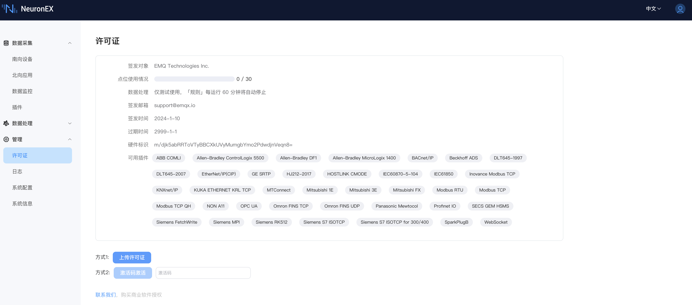

# 许可证政策

NeuronEX 默认安装后提供了 30 个点（30 个数据标签）的免费额度。您可在不安装 EMQ 许可证的情况下，运行这些商业模块，具体见下图 **可用插件**。NeuronEX 默认安装后数据处理模块仅供测试使用，创建的规则每运行60分钟后将自动停止。

超出免费数据标签额度，或者完整使用数据处理功能，则必须安装有效的 NeuronEX 试用或商业许可证。NeuronEX 软件可从[ EMQ 官方网站](https://www.emqx.com/zh/try?product=neuronex)上直接下载 。

:::tip 注意

Fanuc Focas Ethernet、Mitsubishi CNC 等 CNC 插件不在 30 点永久免费的范围内。如需使用，可直接 [联系我们](https://www.emqx.com/zh/contact?product=neuronex)。

:::

## 申请许可证

试用的 NeuronEX 许可证可从[ EMQ 官方网站](https://www.emqx.com/zh/contact?product=neuronex)上联系我们 。所有可用的插件模块以及数据处理功能都可以在 1000 个数据标签的限制下试用 15 天。 如果试用 EMQ 许可证过期，您可以通过我们的官网重新申请试用 EMQ 许可证。

:::tip
官网申请试用许可证时，必须使用硬件标识进行设备的绑定。您可直接[联系我们](https://www.emqx.com/zh/contact?product=neuronex)申请不需要硬件标识绑定设备的许可证，或申请正式许可证。
:::

## 管理许可证

申请许可证后，您可在登录 NeuronEX 后，点击 `管理` -> `许可证` 上传许可证。

