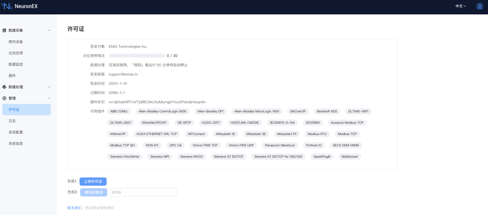

# 许可证政策

EMQX Neuron 装完就能用：默认带一份**永久免费**的许可证，含 30 个数据点位。超出这个额度，或者需要完整的数据处理能力，才需要申请试用或商业许可证。

## 额度对比

| 
项目
 | 免费（默认自带） | 试用 | 商业 |
| --- | --- | --- | --- |
| 数据点位 | 30 个 | 1000 个 | 按订购 |
| 有效期 | 永久 | 15 天 | 按订购期限 |
| 数据处理 | 仅供测试，**规则每运行 60 分钟自动停止** | 完整可用 | 完整可用 |
| CNC 驱动 | 不含 | 含 | 含 |
| 硬件绑定 | 不涉及 | 默认需要绑定硬件标识 | 绑定或不绑定均可 |
| 申请方式 | 无需申请 | [官网申请](https://www.emqx.com/zh/contact?product=neuronex)，同一邮箱最多两次 | [联系 EMQ 商务](https://www.emqx.com/zh/contact?product=neuronex) |

EMQX Neuron 软件本身可从 [EMQ 官网](https://www.emqx.com/zh/try?product=neuronex)直接下载，不需要许可证。

## 免费额度包含什么

默认许可证覆盖大部分标准南向驱动与北向应用——Modbus、OPC UA、西门子与三菱 PLC、EtherNet/IP、IEC 60870、IEC 61850、BACnet、DL/T645、MQTT、Sparkplug B 等，都可以在 30 点位以内直接使用，无需付费。

::: tip 注意
Fanuc Focas Ethernet、Mitsubishi CNC 等 **CNC 驱动不在永久免费范围内**。如需使用，请[联系我们](https://www.emqx.com/zh/contact?product=neuronex)。
:::

驱动与应用是**逐个独立授权**的，你这套实例实际被授权了哪些，以 **管理 → 许可证** 页面的「可用驱动与应用」为准：

支持的协议全集见[南向驱动](../driver-list/driver-list.md)。

## 申请试用许可证

在 [EMQ 官网](https://www.emqx.com/zh/contact?product=neuronex)申请，可在 1000 个数据点位下完整试用所有驱动、应用和数据处理功能，有效期 15 天。过期后可以重新申请，同一邮箱最多申请两次。

::: tip
官网申请的试用许可证**必须绑定硬件标识**。Docker 等容器方式安装的 EMQX Neuron 硬件标识为空，无法绑定——这种情况请[联系我们](https://www.emqx.com/zh/contact?product=neuronex)申请免绑定的许可证。
:::

## 安装与重置

拿到许可证后有三种安装方式：上传许可证文件、输入激活码（适合批量网关）、由 ECP 统一分配浮动许可证。具体操作、查看许可证信息和硬件标识说明，见[申请和安装许可证](../../installation/license_setting.md)。

如需回到默认状态，在 **管理 → 许可证** 页面点击 `重置许可证`，即可恢复为自带的 30 点位免费许可证。
