# OPCUA 驱动性能测试

## 测试目的

在 NeuronEX  OPC UA 驱动连接设备进行大规模数据采集及数据下发场景下，对 NeuronEX 的资源使用情况进行验证，持续监控包括：CPU，内存，网络 IO 及数据下发延迟等。

## 测试架构

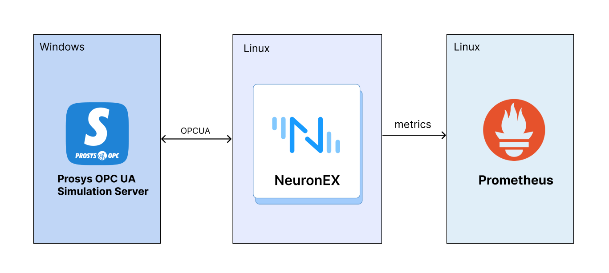

## 测试环境、机器配置及测试工具

- **Prosys OPC UA Simulation Server** ：这款软件是Prosys OPC公司开发的一款高级仿真工具，专为OPC UA（OPC Unified Architecture）技术的开发、测试和教育培训而设计。OPC UA是一种开放的、标准化的通信协议，广泛应用于工业自动化和智能制造领域，它支持跨平台、跨语言的数据交换，并提供高度的安全性和可靠性。

- 部署 NeuronEX 的Linux机器硬件资源：

| NeuronEX 版本     | 操作系统 | CPU       | 内存     |  CPU 型号   |
| ---------------- | ------- | ---------| ------ |------ |
| NeuronEX 3.2.1      | Debian GNU/Linux 12      | 4核   | 30Gi | Intel(R) Xeon(R) Platinum 8269CY CPU T 3.10GHz                    |

- 通过 Prometheus 监控 Linux 机器上 NeuronEX 软件的 CPU、内存、网络 IO 等资源的使用情况。

## 测试场景

### 数据采集场景

- 场景一

NeuronEX 配置 1 个 OPCUA 驱动，该驱动包含 10 个采集组，每个采集组 1 秒 采集 1000个 Float 类型数据，共计 1 万数据点位

- 场景二

NeuronEX 配置 5 个 OPCUA 驱动，每个驱动包含 10 个采集组，每个采集组 1 秒 采集 1000个 Float 类型数据，共计 5 万数据点位

- 场景三

NeuronEX 配置 10 个 OPCUA 驱动，每个驱动包含 10 个采集组，每个采集组 1 秒 采集 1000个 Float 类型数据，共计 10 万数据点位

- 场景四

NeuronEX 配置 1 个 OPCUA 驱动，每个驱动包含 1 个采集组，每个采集组 100 毫秒采集 1000个 Float 类型数据，共计 1 千数据点位

- 场景五

NeuronEX 配置 5 个 OPCUA 驱动，每个驱动包含 1 个采集组，每个采集组 100 毫秒采集 1000个 Float 类型数据，共计 5 千数据点位

- 场景六

NeuronEX 配置 10 个 OPCUA 驱动，每个驱动包含 1 个采集组，每个采集组 100 毫秒采集 1000个 Float 类型数据，共计 1 万数据点位

### 数据下发场景

- 场景七

在 NeuronEX 配置 10 个 OPCUA 驱动，每个驱动包含 10 个采集组，每个采集组 1 秒 采集 1000个 Float 类型数据，共计 10 万数据点位的情况下，下发100个数据点位。

## 结果概述

### 数据采集性能测试

| 场景 | 驱动数量 | 每个驱动group数 | 每个group点位数 | 采集频率 | 总计点位 | 点位类型 | 内存使用 | CPU 使用 | 网络带宽消耗 |
| ---------------- | ------- | ---------| ------ |------ |------ |------ |------ |------ |------ |
| 场景一           | 1个     | 10       | 1000   | 1秒     | 1w      | Float    | 172MB   | 7%      | receive：147kb/s  transmit：186kb/s |
| 场景二           | 5个     | 10       | 1000   | 1秒     | 5w      | Float    | 323MB   | 31%     | receive：738kb/s  transmit：934kb/s |
| 场景三           | 10个    | 10       | 1000   | 1秒     | 10w     | Float    | 594MB   | 60%     | receive：1.49mb/s  transmit：1.88mb/s |
| 场景四           | 1个     | 1        | 1000   | 100ms   | 1000    | Float    | 140MB   | 4%      | receive：148kb/s   transmit：188kb/s  |
| 场景五           | 5个     | 1        | 1000   | 100ms   | 5000    | Float    | 162MB   | 20%     | receive：741kb/s  transmit：939kb/s |
| 场景六           | 10个    | 1        | 1000   | 100ms   | 1w      | Float    | 199MB   | 36%     | receive：1.49mb/s  transmit：1.88mb/s |

### 数据下发延迟测试

| 场景 | 下发方式 | 下发点位数 | 测试次数 | 最小响应时间 | 最大响应时间 | 平均响应时间 |
| ---------------- | ------- | --------- | ------ |------ |------ |------ |
| 在 NeuronEX 配置 10 个 OPCUA 驱动，每个驱动包含 10 个采集组，每个采集组 1 秒 采集 1000个 Float 类型数据，共计 10 万数据点位在正常采集的情况下。 | API 下发 | 100个 | 100次 | 6ms | 19ms | 12ms |

::: tip 注意

- 本测试使用的是模拟器设备，并且采集的数据点位地址均为连续地址段，所以 NeuronEX 与真实设备进行数据采集时，系统资源使用会高于本测试结果。
- 如使用 NeuronEX 数据处理功能，进行数据清洗过滤，边缘计算、算法集成，会额外消耗CPU和内存。

:::

## 具体测试结果

### 场景一

NeuronEX 配置 1 个OPCUA 驱动，该驱动包含 10 个采集组，每个采集组 1 秒 采集 1000个 Float 类型数据，共计 1 万数据点位。

- 内存使用：172MB

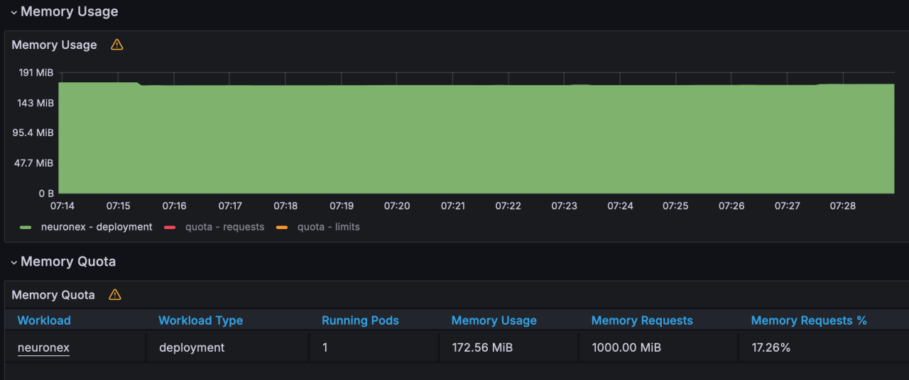

- CPU使用：7%

- 网络 IO 带宽使用：receive:147KB/s;  transmit:186KB/s

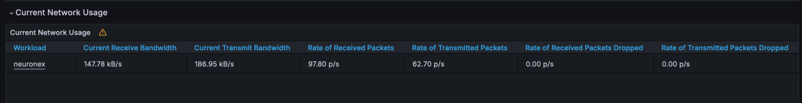
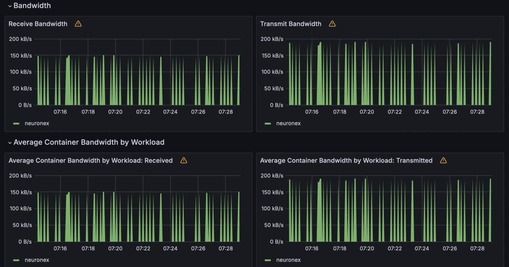

### 场景二

NeuronEX 配置 5 个OPCUA 驱动，每个驱动包含 10 个采集组，每个采集组 1 秒 采集 1000个 Float 类型数据，共计 5 万数据点位。

- 内存使用：323MB

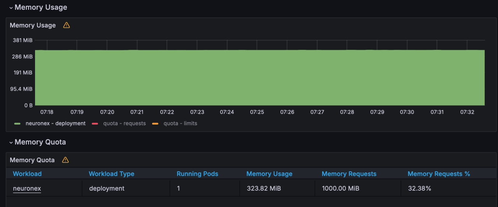

- CPU 使用：31%

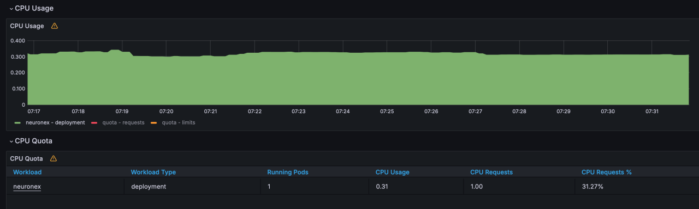

- 网络 IO 带宽使用：receive: 738KB/s;  transmit: 934KB/s

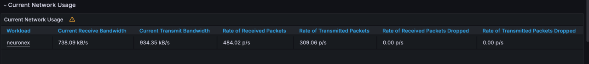

### 场景三

NeuronEX 配置 10 个OPCUA 驱动，每个驱动包含 10 个采集组，每个采集组 1 秒 采集 1000个 Float 类型数据，共计 10 万数据点位。

- 内存使用：594MB

- CPU 使用：60%

- 网络 IO 带宽使用：receive: 1.49MB/s; transmit: 1.88MB/s

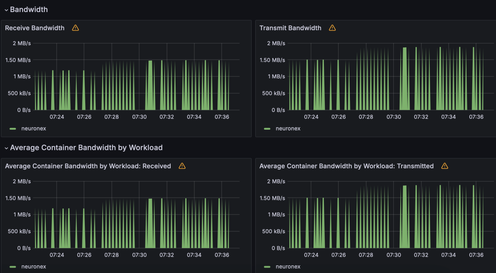

### 场景四

NeuronEX 配置 1 个OPCUA 驱动，每个驱动包含 1 个采集组，每个采集组 100 毫秒采集 1000个 Float 类型数据，共计 1 千数据点位。

- 内存使用：140MB

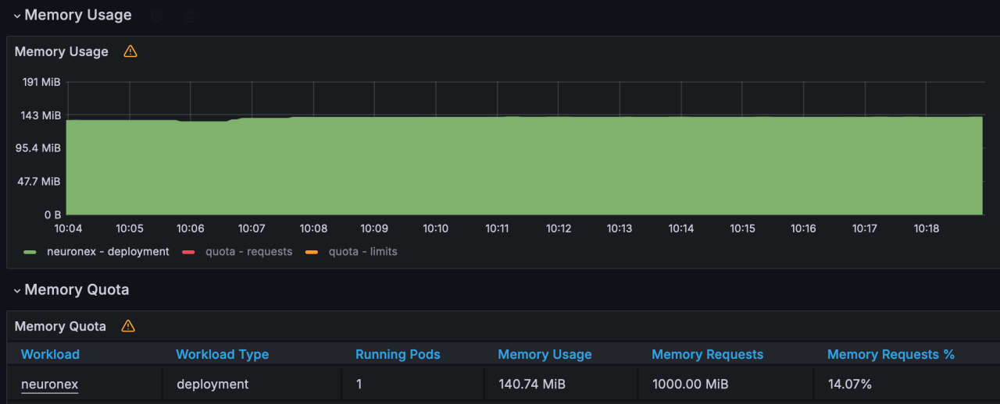

- CPU 使用：4%

- 网络 IO 带宽使用：receive: 148KB/s; transmit: 188KB/s

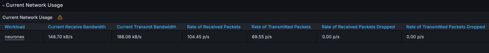

### 场景五

NeuronEX 配置 5 个OPCUA 驱动，每个驱动包含 1 个采集组，每个采集组 100 毫秒采集 1000个 Float 类型数据，共计 5 千数据点位。

- 内存使用：162MB

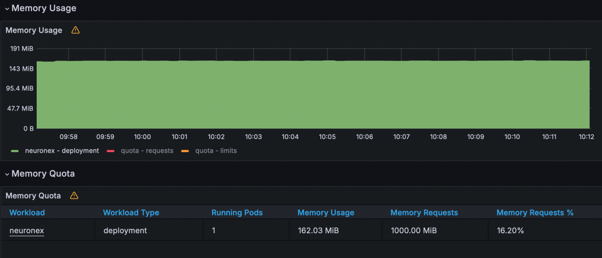

- CPU使用：20%

- 网络 IO 带宽使用：receive: 741KB/s; transmit: 939KB/s

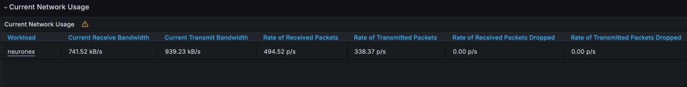
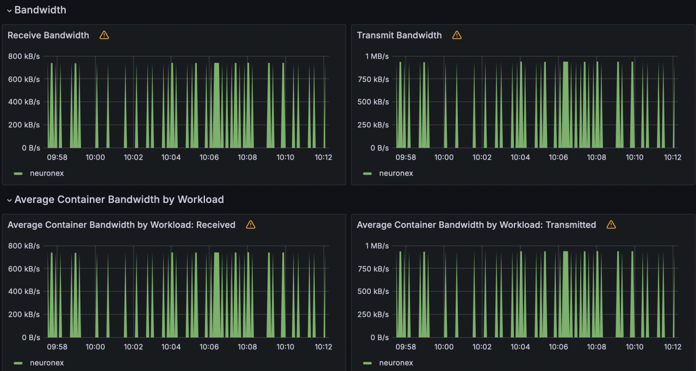

### 场景六

NeuronEX 配置 10 个OPCUA 驱动，每个驱动包含 1 个采集组，每个采集组 100 毫秒采集 1000个 Float 类型数据，共计 1 万数据点位。

- 内存使用：199MB

- CPU使用：36%

- 网络 IO 带宽使用： receive: 1.49MB/s; transmit: 1.88MB/s

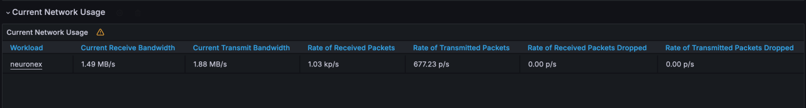
