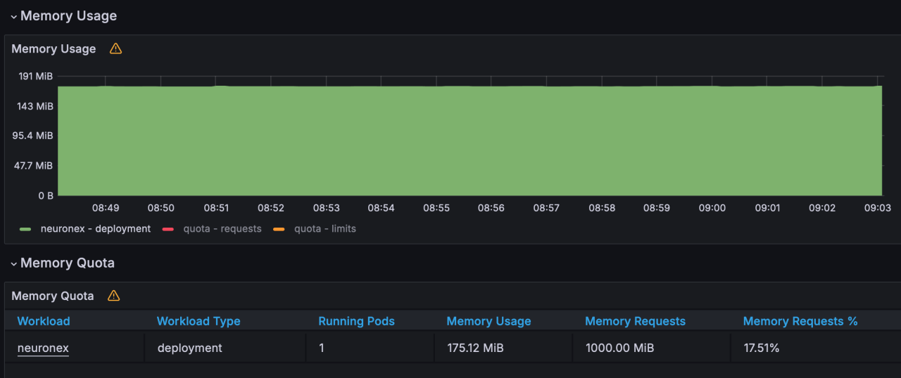
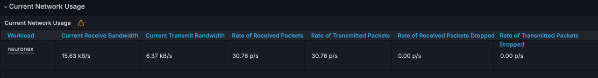
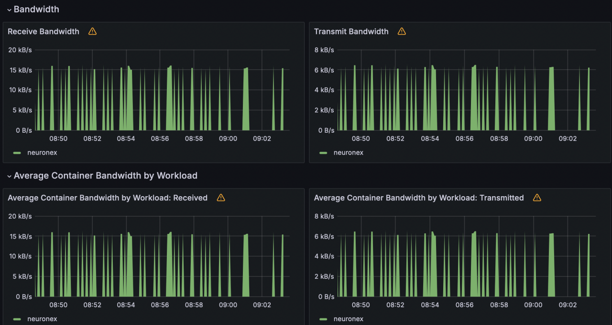
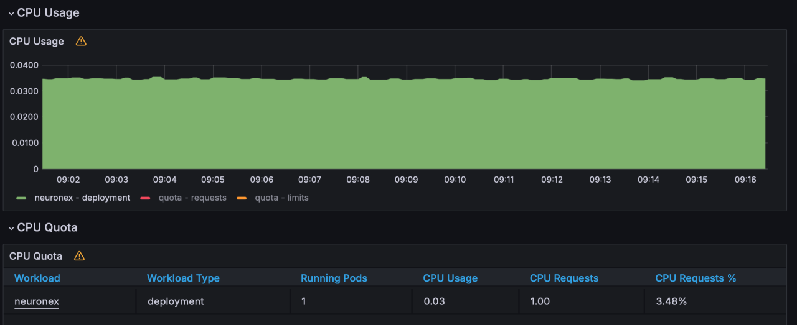
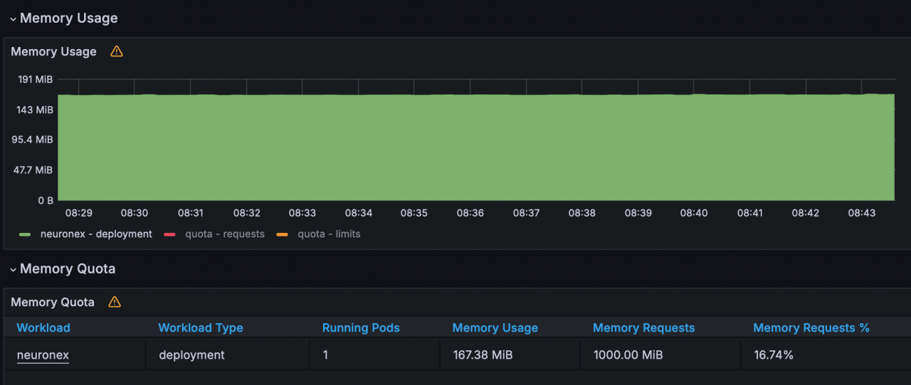
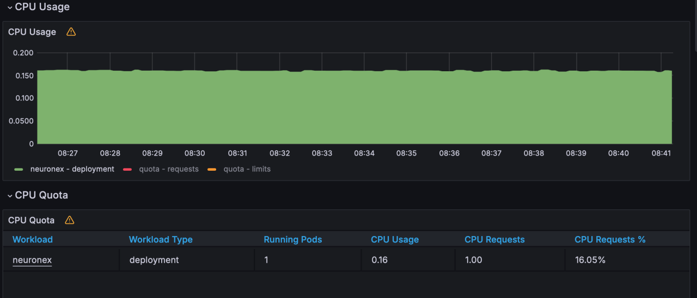
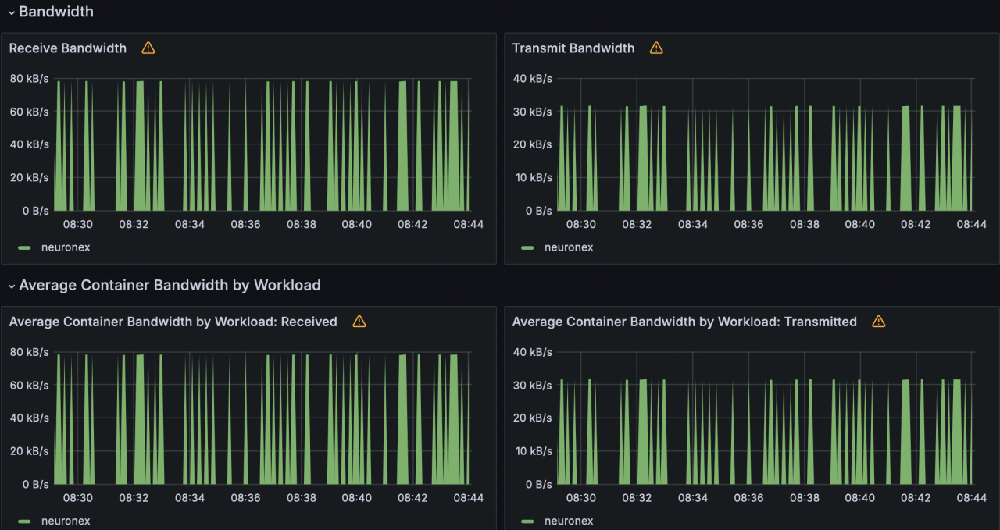
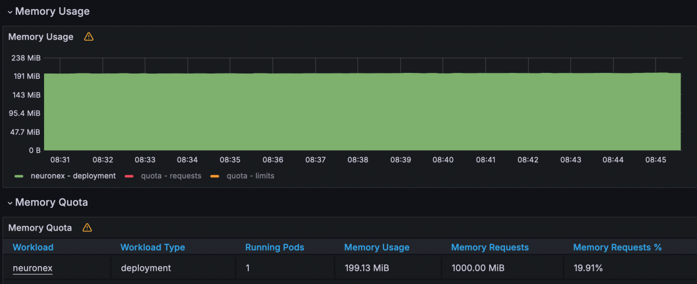

# Siemens S7 驱动性能测试

## 测试目的

在 NeuronEX  Siemens S7 ISOTCP 驱动连接设备进行大规模数据采集及数据下发场景下，对 NeuronEX 的资源使用情况进行验证，持续监控包括：CPU，内存，网络 IO 及数据下发延迟等。

## 测试架构

## 测试环境、机器配置及测试工具

- **Snap7** 是一个开源的、跨平台的通信库，用于与西门子S7系列PLC（可编程逻辑控制器）进行通信。它允许用户通过以太网与S7-200、S7-300、S7-400、S7-1200和S7-1500等型号的PLC进行数据交换。Snap7 提供了一个简单而强大的接口，使得开发人员可以轻松地读取和写入PLC的数据块、内存和标志。

- 部署 NeuronEX 的Linux机器硬件资源：

| NeuronEX 版本     | 操作系统 | CPU       | 内存     |  CPU 型号   |
| ---------------- | ------- | ---------| ------ |------ |
| NeuronEX 3.2.1      | Debian GNU/Linux 12      | 4核   | 30Gi | Intel(R) Xeon(R) Platinum 8269CY CPU T 3.10GHz                    |

- 通过 Prometheus 监控 Linux 机器上 NeuronEX 软件的 CPU、内存、网络 IO 等资源的使用情况。

## 测试场景

### 数据采集场景

- 场景一

NeuronEX 配置 1 个 Siemens S7 驱动，该驱动包含 10 个采集组，每个采集组 1 秒 采集 1000个 Float 类型数据，共计 1 万数据点位

- 场景二

NeuronEX 配置 5 个 Siemens S7 驱动，每个驱动包含 10 个采集组，每个采集组 1 秒 采集 1000个 Float 类型数据，共计 5 万数据点位

- 场景三

NeuronEX 配置 10 个 Siemens S7 驱动，每个驱动包含 10 个采集组，每个采集组 1 秒 采集 1000个 Float 类型数据，共计 10 万数据点位

- 场景四

NeuronEX 配置 1 个 Siemens S7 驱动，每个驱动包含 1 个采集组，每个采集组 100 毫秒采集 1000个 Float 类型数据，共计 1 千数据点位

- 场景五

NeuronEX 配置 5 个 Siemens S7 驱动，每个驱动包含 1 个采集组，每个采集组 100 毫秒采集 1000个 Float 类型数据，共计 5 千数据点位

- 场景六

NeuronEX 配置 10 个 Siemens S7 驱动，每个驱动包含 1 个采集组，每个采集组 100 毫秒采集 1000个 Float 类型数据，共计 1 万数据点位

### 数据下发场景

- 场景七

在 NeuronEX 配置 10 个 Siemens S7 驱动，每个驱动包含 10 个采集组，每个采集组 1 秒 采集 1000个 Float 类型数据，共计 10 万数据点位的情况下，下发100个数据点位。

## 结果概述

### 数据采集性能测试

| 场景 | 驱动数量 | 每个驱动group数 | 每个group点位数 | 采集频率 | 总计点位 | 点位类型 | 内存使用 | CPU 使用 | 网络带宽消耗 |
| ---------------- | ------- | ---------| ------ |------ |------ |------ |------ |------ |------ |
| 场景一           | 1个     | 10       | 1000   | 1秒     | 1w      | Float    | 175MB   | 6%      | receive：15kb/s  transmit：6kb/s |
| 场景二           | 5个     | 10       | 1000   | 1秒     | 5w      | Float    | 355MB   | 25%     | receive：78kb/s  transmit：31kb/s |
| 场景三           | 10个    | 10       | 1000   | 1秒     | 10w     | Float    | 512MB   | 57%     | receive：155kb/s  transmit：62kb/s |
| 场景四           | 1个     | 1        | 1000   | 100ms   | 1000    | Float    | 143MB   | 3%      | receive：15kb/s   transmit：6kb/s  |
| 场景五           | 5个     | 1        | 1000   | 100ms   | 5000    | Float    | 167MB   | 16%     | receive：78kb/s  transmit：31kb/s |
| 场景六           | 10个    | 1        | 1000   | 100ms   | 1w      | Float    | 199MB   | 37%     | receive：156kb/s  transmit：63kb/s |

### 数据下发延迟测试

| 场景 | 下发方式 | 下发点位数 | 测试次数 | 最小响应时间 | 最大响应时间 | 平均响应时间 |
| ---------------- | ------- | --------- | ------ |------ |------ |------ |
| 在 NeuronEX 配置 10 个 Modbus TCP 驱动，每个驱动包含 10 个采集组，每个采集组 1 秒 采集 1000个 Float 类型数据，共计 10 万数据点位在正常采集的情况下。 | API 下发 | 100个 | 100次 | 15ms | 47ms | 30ms |

::: tip 注意

- 本测试使用的是模拟器设备，并且采集的数据点位地址均为连续地址段，所以 NeuronEX 与真实设备进行数据采集时，系统资源使用会高于本测试结果。
- 如使用 NeuronEX 数据处理功能，进行数据清洗过滤，边缘计算、算法集成，会额外消耗CPU和内存。

:::

## 具体测试结果

### 场景一

NeuronEX 配置 1 个 Siemens S7 驱动，该驱动包含 10 个采集组，每个采集组 1 秒 采集 1000个 Float 类型数据，共计 1 万数据点位

- 内存使用：175MB

- CPU 使用：6%

- 网络 IO 带宽使用： receive:15KB/s; transmit:6KB/s

### 场景二

NeuronEX 配置 5 个 Siemens S7 驱动，每个驱动包含 10 个采集组，每个采集组 1 秒 采集 1000个 Float 类型数据，共计 5 万数据点位

- 内存使用：355MB

- CPU 使用：25%

- 网络 IO 带宽使用： receive:78KB/s; transmit:31KB/s

### 场景三

NeuronEX 配置 10 个 Siemens S7 驱动，每个驱动包含 10 个采集组，每个采集组 1 秒 采集 1000个 Float 类型数据，共计 10 万数据点位

- 内存使用：512MB

- CPU 使用：57%

- 网络 IO 带宽使用： receive:155KB/s; transmit:62KB/s

### 场景四

NeuronEX 配置 1 个 Siemens S7 驱动，每个驱动包含 1 个采集组，每个采集组 100 毫秒采集 1000个 Float 类型数据，共计 1 千数据点位

- 内存使用：143MB

- CPU 使用：3%

- 网络 IO 带宽使用： receive:15KB/s; transmit:6KB/s

### 场景五

NeuronEX 配置 5 个 Siemens S7 驱动，每个驱动包含 1 个采集组，每个采集组 100 毫秒采集 1000个 Float 类型数据，共计 5 千数据点位

- 内存使用：167MB

- CPU 使用：16%

- 网络 IO 带宽使用： receive:78KB/s; transmit:31KB/s

### 场景六

NeuronEX 配置 10 个 Siemens S7 驱动，每个驱动包含 1 个采集组，每个采集组 100 毫秒采集 1000个 Float 类型数据，共计 1 万数据点位

- 内存使用：199MB

- CPU 使用：37%

- 网络 IO 带宽使用： receive:156KB/s; transmit:63KB/s

