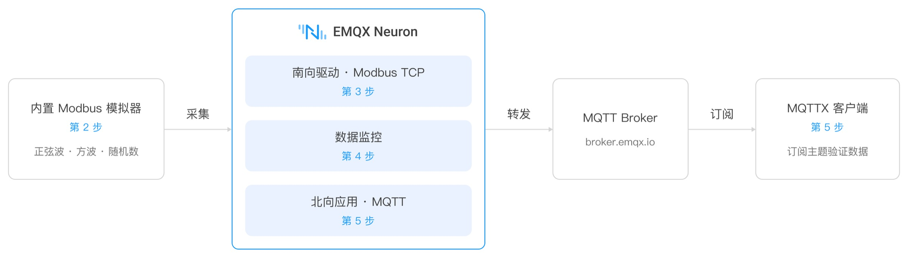
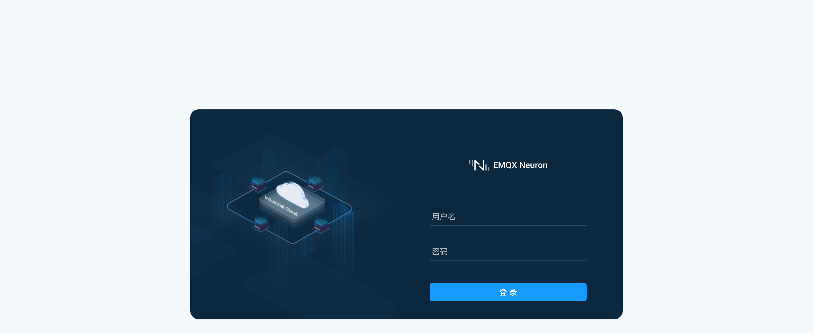
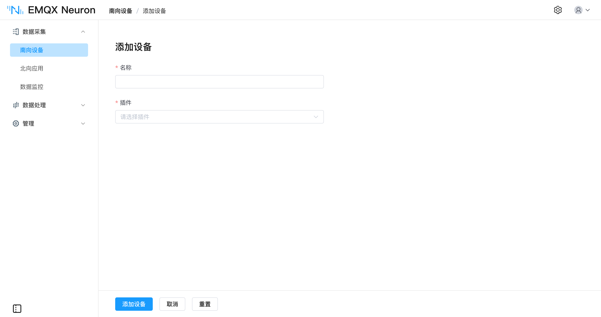
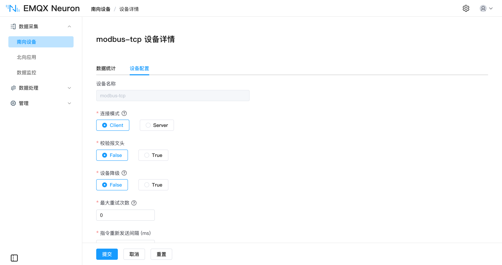
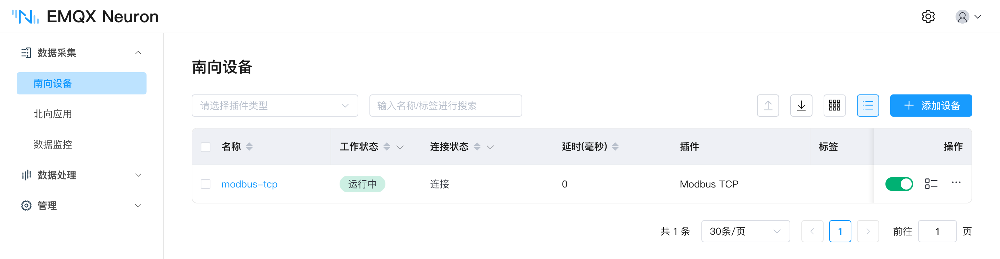
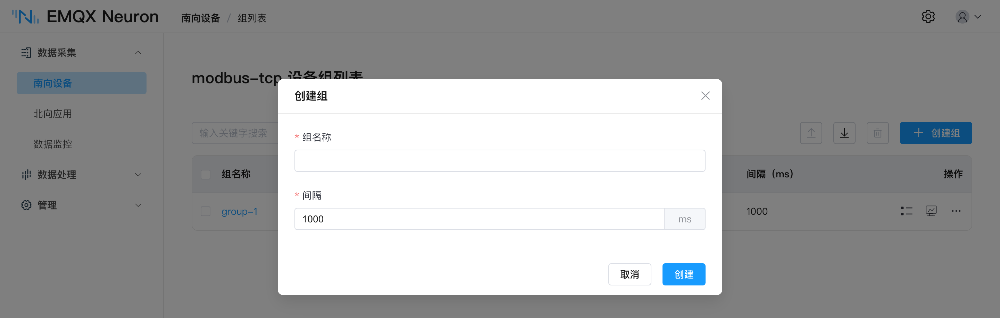
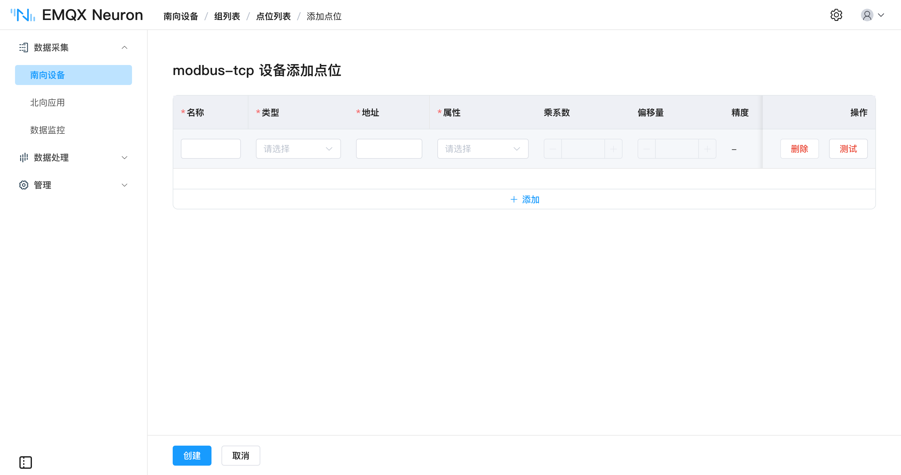
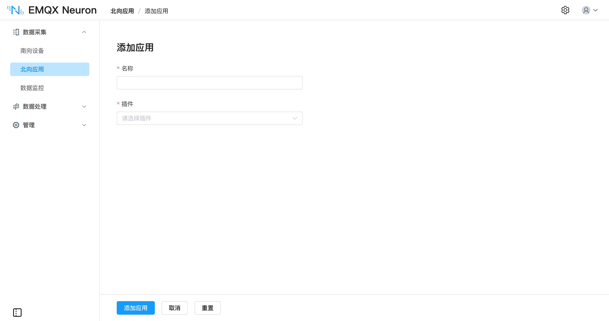
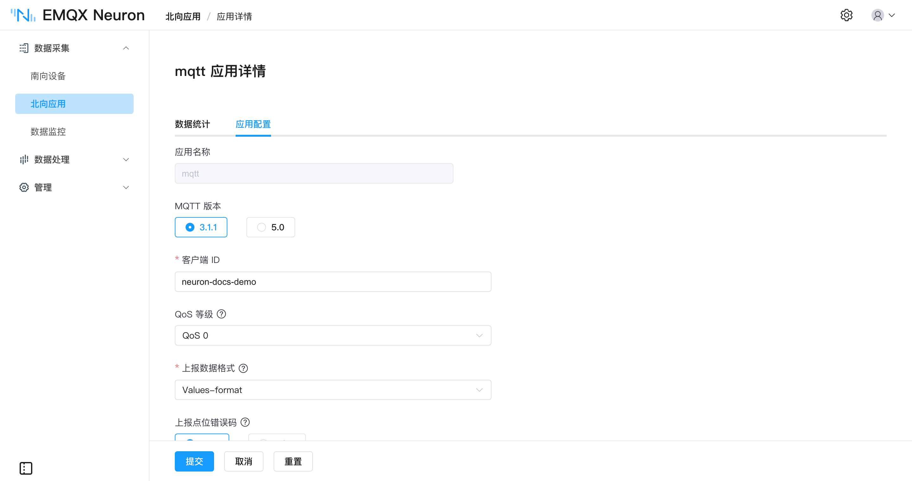
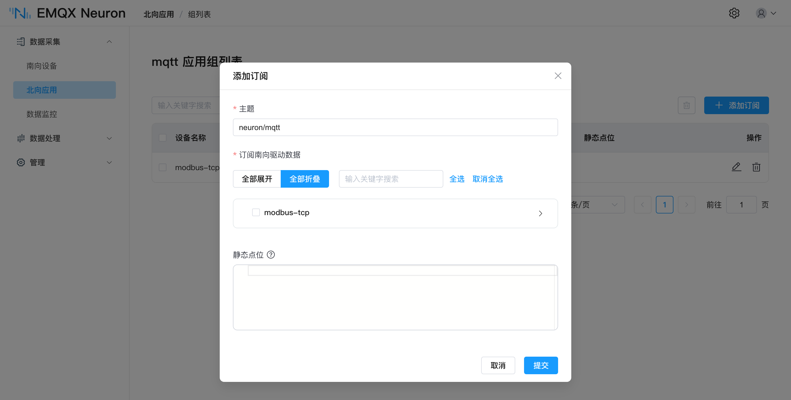

# 快速入门

本教程分五步完成一条完整链路：启动 EMQX Neuron、用内置模拟器造一批数据、通过南向驱动采集上来、在数据监控中确认数据、再经北向应用转发到 MQTT Broker。



## 开始之前

| 需要什么 | 说明 |
| --- | --- |
| Docker | 用来运行 EMQX Neuron。其他安装方式见[安装与部署](../installation/introduction.md) |
| 浏览器 | 访问 EMQX Neuron 控制台 |
| MQTT 客户端 | 最后一步验证数据用，推荐 [MQTTX](https://www.emqx.com/zh/products/mqttx) |

## 第 1 步 · 启动 EMQX Neuron

拉取镜像并启动容器：

```bash
docker pull emqx/neuronex:latest
docker run -d --name neuronex -p 8085:8085 --log-opt max-size=100m emqx/neuronex:latest
```

浏览器打开 `http://127.0.0.1:8085`，用初始账号 **admin** / **0000** 登录。



## 第 2 步 · 启动内置模拟器

EMQX Neuron 内置了一个 Modbus TCP 模拟器，可直接产生动态数据，无需准备真实 PLC。

1. 进入 **数据采集 → Modbus TCP Slave 模拟器**。
2. 点击 `启动模拟器`。模拟器默认关闭，不占用资源，需要手动启动。
3. 添加点位。最多 10 个，模拟类型可选 `正弦波`、`斜波`、`方波`、`随机数`，地址由系统自动分配。
4. 点击 `保存点位配置`，模拟器开始产生数据。

模拟器监听 `502` 端口，与 EMQX Neuron 在同一容器内，不涉及跨机器网络。完整说明见[Modbus TCP Slave 模拟器](../configuration/modbus-simulator.md)。

::: tip 走捷径
在模拟器页面点击 `下载对应南向驱动配置`，得到的文件里已经包含全部点位。在 **数据采集 → 南向设备** 页导入它，可以直接跳到[第 4 步](#第-4-步-查看采集数据)。想了解驱动、组、点位是怎么配出来的，就按下面第 3 步手动做一遍。
:::

## 第 3 步 · 添加南向驱动并配置点位

南向驱动负责和设备通信。这里用 Modbus TCP 驱动去读模拟器的数据。

### 创建驱动节点

在 **数据采集 → 南向设备** 页点击 `添加设备`：



| 字段 | 填什么 |
| --- | --- |
| 名称 | `modbus-tcp` |
| 驱动 | 选择 **Modbus TCP** |
| 连接模式 | `Client` |
| IP 地址 | `127.0.0.1`（模拟器与 EMQX Neuron 在同一容器内） |
| 端口 | `502` |
| 连接超时时间 | `3000` |



驱动刚创建时连接状态为 **断开**，属正常现象。配置点位之后，EMQX Neuron 才会向设备发送读请求。



::: tip
不同协议需要的参数不同，各驱动的完整参数说明见[南向驱动](../introduction/driver-list/driver-list.md)。
:::

### 创建组

点击已创建的 **modbus-tcp** 节点进入组列表，点击 `创建组`：



| 字段 | 填什么 |
| --- | --- |
| 组名称 | `group-1` |
| 间隔 | `1000`（毫秒，即每秒采集一次） |

组是采集和上报的最小单位，同一组内的点位按相同频率采集。

### 添加点位

点击 **group-1** 的 `点位列表` → `添加点位`：



| 字段 | 填什么 |
| --- | --- |
| 名称 | `pressure` |
| 属性 | `Read` |
| 类型 | `int16` |
| 地址 | 填模拟器中该点位的地址，格式为 `站点号!寄存器地址`，例如 `1!40001` |

::: tip
`1!40001` 中，`1` 是从站地址，`40001` 是保持寄存器地址。各驱动的地址格式不同，详见对应的驱动页面。
:::

点位创建完成后，节点状态应变为 **运行中** / **已连接**。若几秒后仍是 **断开连接**，在容器内执行以下命令确认端口可达：

```bash
docker exec -it neuronex telnet 127.0.0.1 502
```

## 第 4 步 · 查看采集数据

进入 **数据采集 → 数据监控**，选择南向设备 `modbus-tcp` 和组 `group-1`，即可看到点位的实时值随模拟器变化。


数据能在这里刷新，说明采集链路已经通了。

## 第 5 步 · 转发到 MQTT

### 创建北向应用

在 **数据采集 → 北向应用** 页点击 `添加应用`：



| 字段 | 填什么 |
| --- | --- |
| 名称 | `mqtt` |
| 应用 | 选择 **MQTT** |

创建后自动进入应用配置页：



| 字段 | 填什么 |
| --- | --- |
| 服务器地址 | `broker.emqx.io`（EMQX 公共 Broker） |
| 服务器端口 | `1883` |

提交后应用卡片进入 **运行中** 状态。

### 订阅南向数据

数据以**组**为单位上报，需要指定上报哪些组。点击 MQTT 应用的 `查看订阅` → `添加订阅`：



| 字段 | 填什么 |
| --- | --- |
| 主题 | 用默认主题即可，记下它 |
| 订阅南向驱动数据 | 勾选 `modbus-tcp` 的 `group-1` |

### 在 MQTT 客户端验证

打开 MQTTX，新建连接（Host `broker.emqx.io`，Port `1883`），订阅上一步记下的主题：


持续收到 EMQX Neuron 上报的数据，即表示整条链路已连通。

## 下一步

- **接真实设备** —— 在[南向驱动](../introduction/driver-list/driver-list.md)里按协议或 CNC 型号找到对应页面，参数和地址格式都在那里。
- **上报到其他目的地** —— 除 MQTT 外还支持 AWS IoT、Azure IoT、Sparkplug B、Kafka，以及对外开放 OPC UA Server，见[北向应用](../configuration/north-apps/catalog.md)。
- **在边缘处理数据** —— 过滤、换算、聚合之后再上报，见[第一条规则](../streaming-processing/first-rule.md)。
- **装到生产环境** —— 见[安装与部署](../installation/introduction.md)。
