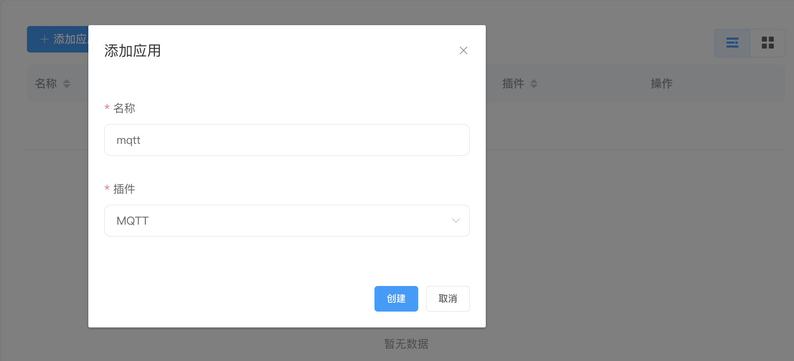

# 快速开始

本章节将指导用户从下载安装开始，以 Modbus TCP 驱动协议为例，快速开始使用 NeuronEX 采集模拟设备数据，并将数据直接上传到 MQTT Broker，以及数据流处理功能的简单使用。


## 安装 NeuronEX

NeuronEX 提供多种安装方式，用户可在 [安装](../install/introduction.md) 中查看详细的安装方式。本实例采用容器化部署的方式，以便于最快开始体验 NeuronEX。

获取 Docker 镜像

```
$ docker pull emqx/neuronex:latest
```

启动 Docker 容器

```
$ docker run -d --name neuronex -p 8085:8085  emqx/neuronex:latest
```

## 安装 Modbus 模拟器

安装 PeakHMI Slave Simulators 软件，安装包可在 [PeakHMI 官网](https://hmisys.com) 中下载。

安装后，运行 Modbus TCP slave EX。设置模拟器点位数值及站点号，如下图所示。


:::tip 
须保证 NeuronEX 与模拟器运行在同一局域网内。

Windows 中尽量关闭防火墙，否则可能会导致 NeuronEX 连接不上模拟器。 

:::

## 登录 NeuronEX

打开 Web 浏览器，输入运行 NeuronEX 的网关地址和端口号，即可进入到登录界面，默认端口号为 8085。例如，http://127.0.0.1:8085

使用初始用户名与密码登录进入管理控制台页面（初始用户名：admin，初始密码：0000），登录界面如下图所示。


## 南向设备配置

### 创建南向设备节点

南向设备节点用于 NeuronEX 与设备建立连接，以及设备数据采集点位的创建及配置。在本例中使用NeuronEX的Modbus TCP插件，获取Modbus模拟器中的数据。

在 `数据采集` 菜单中选择 `南向设备` 进入南向设备管理界面，单击 `添加设备` 新增设备，如下图所示。


- 名称：填写设备名称，例如 modbus-tcp；
- 方式：默认选择插件；
- 插件：下拉框选择 Modbus TCP 的插件；
- 单击 `创建` 新增设备。

### 配置南向设备节点

配置 NeuronEX 与设备建立连接所需的参数。

南向节点创建成功后自动跳转到 `设备配置` 界面，如下图所示。


- IP地址：填写访问设备的 IP 地址。示例填写安装 Modbus 模拟器 PC 端的 IP 地址；
- 端口：默认端口 502；
- 单击 `提交`，完成设备配置，设备卡片自动进入 **运行中** 的工作状态；

:::tip 
每个设备所需的配置参数有所不同，详细南向设备参数说明可参考 [创建南向驱动](../config/south-devices/south-devices.md)。 
:::

### 创建采集点位

创建组用于设备点位的分类及统一管理。单击刚创建的 **modbus-tcp** 南向设备节点任意空白处进入组列表管理界面。

单击 `创建` ，在 `创建组` 的弹框中填写相关参数，如下图所示。


- 组名称：填写组名称，例如 group-1；
- 点击 `创建`，完成组创建。

手动为组创建点位，单击刚创建的 **group-1** 组列表任意空白处进入点位列表界面。

单击 `创建`，在 `添加点位` 页面新建需要采集的设备点位，配置点位属性、类型、地址等，如下图所示。


- 名称：填写设备点位名称，例如，pressure；
- 属性：下拉选择点位属性，例如，Read；
- 类型：下拉选择数据类型，例如，int16；
- 地址：填写驱动点位地址，例如，1!40001；
- 点击`创建`按键，完成 Tag 的创建；

:::tip
点位地址解析：1 表示 Modbus 模拟器中设置的点位站点号，40001 表示点位的寄存器地址。

详细的驱动地址使用说明请参阅 [创建南向驱动](../config/south-devices/south-devices.md)。 
:::

创建采集的设备点位后，NeuronEX 自动与设备建立通信。南向设备节点进入 **运行中** 的工作状态，**已连接** 的连接状态。

如果等待几秒后，连接状态仍然处于 **断开连接**，请进行以下操作查找原因：

- 请确认在设备配置时 IP 地址 和端口号设置正确，并且防火墙处于关闭状态。
- 在 NeuronEX 运行环境终端执行以下指令，以确认 NeuronEX 运行环境能否访问到到对应的 IP 及端口：

```
$ telnet <运行 Modbus 模拟器 PC 端的 IP> 502
```

## 查看采集数据

在 `数据采集` 菜单下选择`数据监控`，进入数据监控界面，查看已创建点位读取到的数值，如下图所示。


数据监控以组为单位显示数值：

- 南向设备：下拉框选择想要查看的南向设备，例如，选择上面步骤已创建好的 modbus-tcp;
- 组名称：下拉框选择想要查看所选南向设备下的组，例如，选择上面步骤已经创建好的 group-1；
- 选择完成，页面将会展示组下每一个点位的值；

## 北向应用配置

### 创建北向应用节点

北向应用节点用于 NeuronEX 与多种北向应用进行数据交互，以 MQTT 插件为例，新增一个 MQTT 节点。

在 `数据采集` 菜单中选择 `北向应用`，单击 `添加应用` 新增应用，如下图所示。



- 名称：填写应用名称，例如，mqtt；
- 插件：下拉框选择 MQTT 插件；
- 单击 `创建` 新增应用。

### 配置北向应用节点

配置 NeuronEX 与北向应用建立连接所需的参数。

北向节点创建成功后自动跳转到 `应用配置` 界面，如下图所示。


- 服务器地址：填写应用的服务器地址，默认使用公共的 EMQX Broker（broker.emqx.io）；
- 服务器端口：填写服务器端口，默认使用 1883；
- 单击 `提交`，完成北向应用配置，应用卡片自动进入 **运行中** 的工作状态。

### 订阅南向组

采集到的数据都是以组为单位上传云端的，用户需要选择上传哪些组的数据。

点击刚创建的 **mqtt** 北向应用节点任意空白处，进入组列表界面。

单击 `添加订阅` 新增订阅，如下图所示。


- 主题：可自定义主题，示例使用默认主题；
- 订阅南向驱动数据：自主选择需要订阅的数据组；
- 点击`提交`，完成订阅。

## 在 MQTT 客户端查看数据

使用 MQTT 客户端查看上传的数据，示例使用 MQTT 客户端工具 [MQTTX](https://www.emqx.com/zh/products/mqttx) 连接公共的 EMQX 代理查看 NeuronEX 上传到 MQTT Broker 的数据，如下图所示。


订阅成功之后可以看到 MQTTX 可以一直接收到 NeuronEX 采集并上报过来的数据。

- 打开 MQTTX 添加新的连接，正确填写名称、Host（broker.emqx.io） 和 Port（默认 1883）完成连接;
- 添加新的订阅，Topic 要与 NeuronEX 端北向应用的订阅主题保持一致。

## 数据流处理

NeuronEX 提供了数据流处理功能，可以对数据点进行数据抽取、转换、过滤、排序、分组、聚合、连接等功能，通过强大的流式计算分析能力，实现数据过滤清洗、数据标准化、分析监测及实时报警。

本示例将介绍如何将 NeuronEX 采集到的数值进行 +1 操作后将结果发送到云端 MQTT 的动态主题中。

### 数据流北向应用节点

在**数据采集** ->  **北向应用**页面，NeuronEX默认已经配置一个DataProcessing的北向应用，用户只需通过该应用订阅**南向驱动**的**数据组**即可，然后NeuronEX采集到的数据点就会发送到数据流处理模块的neuronStream 数据流中。


### 新建规则

在 `数据流处理` 菜单中选择 `规则`，单击 `新建规则`，如下图所示。


在`动作`模块中单击`添加`，如下图所示。


- Sink：下拉框选择 **mqtt**；
- MQTT 服务器地址：正确填写 MQTT IP地址和端口号；
- MQTT 主题：数据上报主题，示例使用默认主题；

## 查看流处理结果

示例中数据流节点订阅的 node_name 为 modbus-tcp，group_name 为 group-1，即，订阅主题为 modbus-tcp/group-1。

