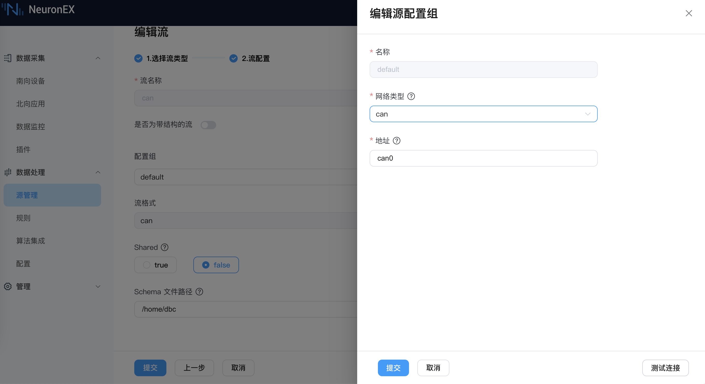

# CAN

流        扫描表

NeuronEX 数据处理模块通过 `CAN` 类型的数据源，可以接收来自 CAN 协议总线的数据，将原始数据解析为结构化数据。CAN 类型可以作为流、扫描表的数据源。

## 创建流

登录 NeuronEX，点击**数据处理** -> **源管理**。在**流管理**页签，点击**创建流**。

在弹出的**源管理** / **创建**页面，进入如下配置：

- **流名称**：输入流名称
- **是否为带结构的流**：勾选确认是否为带结构的流，如为带结构的流，则需进一步添加流字段。可默认不勾选。
- **配置组**：可使用默认配置组，如希望自定义配置组，可点击添加配置组按钮，在弹出的对话框中进行如下设置，设置完成后，可点击**测试连接**进行测试：
  - **名称**：必填项，输入配置组名称。
  - **网络类型**：必填项，can总线的网络类型，默认选择can。
  - **地址**：必填项，can总线的物理接口地址。
- **流格式**：只能选择 can 格式，无法修改。
- **共享**：勾选确认是否共享源。
- **Schema 文件路径**：dbc文件的所在路径。dbc文件是描述 CAN 总线数据结构的文件。

以下图为例，NeuronEX 通过网卡 can0 接收数据，并根据`/home/dbc`目录下的.dbc文件，将 can 数据解析为结构化 json 数据。
