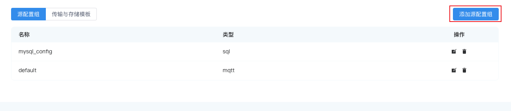
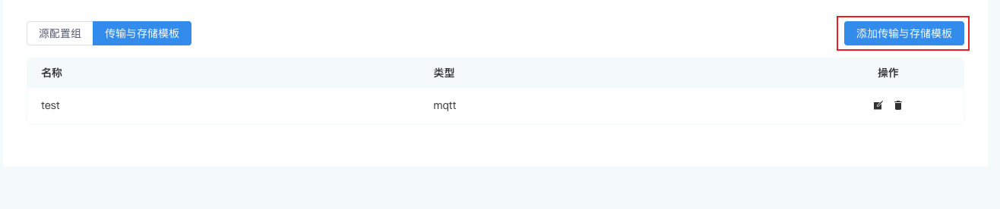

# 配置

本页面介绍如何进行资源配置以及模式配置。

## 资源

资源包括`源配置组`和`传输与存储模版`两部分内容。

### 源配置组

每个源都会有自己的配置文件，用户在创建流/表时可同步进行相应配置。您可在**数据处理** -> **配置** -> **资源** 的**源配置组**页签查看已添加的配置，编辑相关操作，或删除配置组，也可点击右上角的**添加配置组**按钮进行添加。



### 传输与存储模版

每个动作(Sink)对应的传输与存储模版，您可在**数据处理** -> **配置** -> **资源** 的**传输与存储模版**页签查看已添加的配置，编辑相关操作，或删除配置组，也可点击右上角的**添加传输与存储模版**按钮进行添加。



## 模式

模式是一套元数据，用于定义数据结构。例如，Protobuf 格式中使用 .proto 文件作为模式定义传输的数据格式。目前，NeuronEX 仅支持 protobuf 和 custom 这两种模式。

您可根据业务场景确定是否需要定义模式，该功能适用于输入数据类型固定且需要强大验证的场景。

例如，当数据源的格式为 json 时，定义流的模式信息将有助于在解析 json 数据时仅将模式定义中的数据被解析出来。当数据源中单条信息的结构较为复杂或者较大且模式定义中所需要的信息明确并简单时，解析仅需的 json 数据将极大的降低单条数据的处理时间，从而提升性能。

本节以 Protobuf 格式为例，讲解如何在 NeuronEX 中设置编解码格式。

### 前置准备

开始动手操作之前，需要准备以下环境：

- MQTT broker 用于数据传输。本教程使用位于 `tcp://broker.emqx.io:1883` 的 MQTT 服务器， `broker.emqx.io` 是一个由 [EMQ](https://www.emqx.cn/) 提供的公有 MQTT 服务器。
- MQTT 客户端用于观察结果，例如 [MQTTX](https://mqttx.app/)
- 模式 .so 文件，NeuronEX 支持动态解析和静态解析两种方式。使用动态解析时，用户仅需要在注册模式时指定 proto 文件。在解析性能要求更高的条件下，用户可采用静态解析的方式。静态解析需要开发解析插件，其步骤可参考 [静态 Protobuf 页面](https://ekuiper.org/docs/zh/latest/guide/serialization/serialization.html#%E9%9D%99%E6%80%81-protobuf)

### 添加模式

相比于无模式的 JSON 格式，Protobuf 需要提前定义数据结构，即模式。在 proto 文件中，可以包含多个 message 以及其他实体的定义，但是在编解码格式的配置中，只有 message 的定义可以被使用。 本教程将使用以下模式进行数据结构的定义。该文件定义了一个名为 Book 的 message 结构，其中包含字符串类型的 title 和整型的 price。传输的数据将依据此结构对书籍数据进行二进制数据的编解码。

```bash
message Book {
  required string title = 1; 
  required int32 price = 2;
}
```

1. 在 NeuronEX 界面，点击 **数据处理** -> **配置** -> **模式**，点击右上角的**创建模式**按钮.
2. 在弹出的对话框中，按照如下说明进行设置。
   - 名称：输入模式名称，例如 schema1
   - 模型类型：目前支持 protobuf 和 custom 两类，选择 protobuf
   - 模式二进制文件：静态解析模式下，请上传模式 .so 文件
   - 模式内容：通过文件或者直接在文本输入框中输入模式内容。

3. 点击**提交**，新创建的模式将出现在下方的模式列表中。

::: tip

您可在一条模式中定义多条消息，例如下面的消息中就定义两个消息：HelloRequest 和 HelloReply

```bash
message HelloRequest {
string name = 1;
}

message HelloReply {
string message = 1;
}
```

:::

<!-- ## 文件管理

添加文件作为数据源或者通过文件批量规则时，您需要将提前准备好的文件上传至 NeuronEX。操作步骤如下：

登录 NeuronEX，点击**数据处理** -> **配置** -> **文件管理**，点击**创建文件**按钮。

NeuronEX 目前支持两种方式上传配置文件：上传文件或者提供文件名和文本内容。如选择**自定义文件**，请在文件名称处同时提供文件名和后缀，如 `my.json`，随后在文件内容处通过上传或者直接贴入文件内容。

点击**提交**后，文件将出现在**文件管理**页面的列表中，名称包含该文件的路径和文件名，如：

```
/opt/neuron/ekuiper/data/uploads/my.json
``` -->
