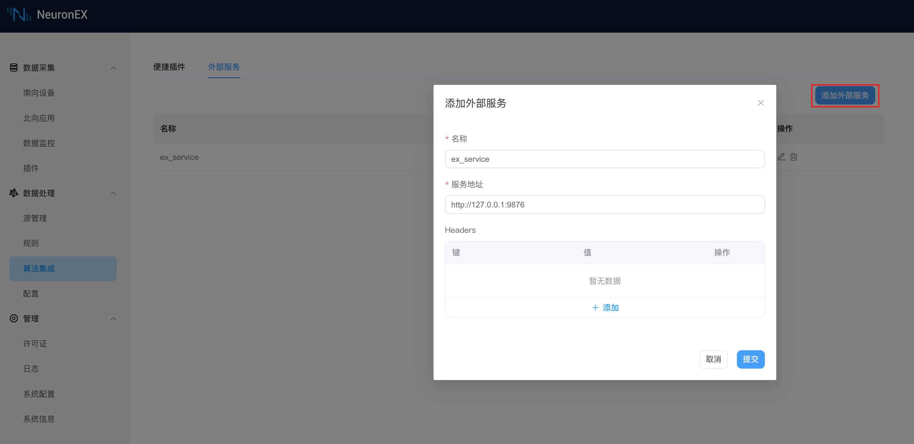

# 外部算法函数示例

该示例从 neuronStream 数据源选择 `tag1` 和 `tag2` 两个数据点，通过 HTTP POST 发往外部 HTTP 服务,经过加法运算后返回结果。


## 启动一个外部服务
在本地通过以下 Python 代码启动一个外部服务，端口为`9876`，提供一个API接口`/api/test1`接收`POST`方法,该外部服务获取请求 JSON 数据中的 `a` 和 `b` 字段，相加后返回结果。

```python
from flask import Flask, request, jsonify

app = Flask(__name__)

@app.route('/api/test1', methods=['POST'])
def test1():
    try:
        data = request.get_json()  # 获取POST请求中的JSON数据
        a = data['a']
        b = data['b']
        result = a + b
        return jsonify({'result': result}), 200  # 返回JSON格式的结果和状态码200
    except Exception as e:
        return jsonify({'error': str(e)}), 400  # 如果发生错误，返回错误信息和状态码400

if __name__ == '__main__':
    app.run(host='0.0.0.0', port=9876)
```

## NeuronEX 中创建一个外部服务

点击**数据处理** -> **算法集成**，在**外部服务**页签，点击**添加外部服务**。

- **名称**：ex_service
- **服务地址**：`http://127.0.0.1:9876`
- **Headers**：不填



:::tip
  确保 NeuronEX 的网络和 Python 外部服务的网络连通。
:::

## 在规则中使用外部服务

在规则中输入如下内容：


其中规则中使用的 `neuronStream` 数据流，数据输入如下：
```json
  {
    "timestamp": 1701134996987, 
    "node_name": "modbus1", 
    "group_name": "group1", 
    "values": {
      "tag1": 1,
      "tag2": 2,
      "tag3": 3,
      "tag4": 4,
      }, 
    "errors": {},
    "metas": {},
  }
```

`ex_service("post","/api/test1", object_construct("a",values.tag1 ,"b", values.tag2))` 表示，会通过 HTTP POST 方法把函数`object_construct("a",values.tag1 ,"b", values.tag2)`的结果发送到 HTTP Server地址 `http://127.0.0.1:9876/api/test1` ,并将收到的外部服务的处理结果发送到 Sink 中。

这里选择使用数据处理模块的内置函数`object_construct`的原因是，原始数据流 `neuronStream` 的数据格式及数据名称与外部函数的入参要求不符。`object_construct("a",values.tag1 ,"b", values.tag2)`的计算结果为`{"a":1,"b":2}`，将该结果传入外部服务。

## 查看计算结果

开启规则调试，查看输出结果正确 `{"ex_service":{"result":3}}`。

