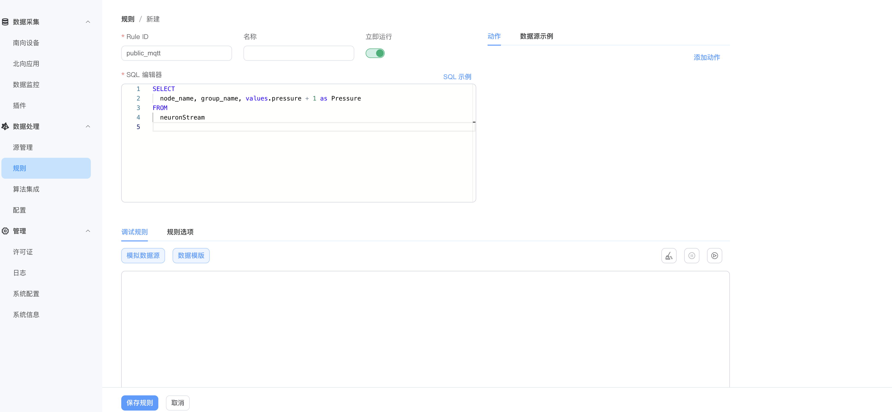
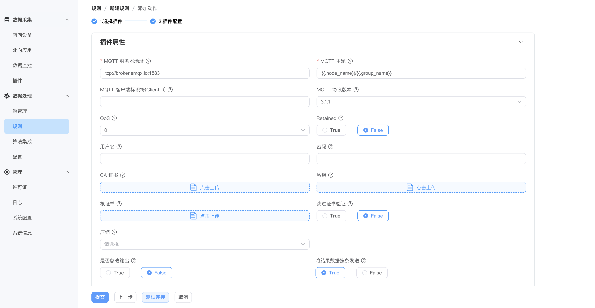

# 第一条规则

本文接着[快速入门](../quick-start/quick-start.md)往下走：那里把设备数据采集上来并原样转发到了 MQTT，这里加一步边缘处理——把采集到的数值加 1，再发到一个动态主题上。

本文假设已按快速入门完成 `modbus-tcp` 南向驱动与 `group-1` 采集组的配置。

## 第 1 步 · 让数据进入规则引擎

规则引擎作为一个北向应用接收南向数据，所以先给它订阅数据组。

在 **数据采集 → 北向应用** 页找到默认已存在的**规则引擎应用**，点击 `查看订阅` → `添加订阅`，勾选 `modbus-tcp` 的 `group-1`。

订阅之后，采集到的点位会进入规则引擎的 `neuronStream` 数据流，供 SQL 使用。

## 第 2 步 · 新建规则

在 **数据处理 → 规则** 页点击 `新建规则`，编写 SQL 语句将 `pressure` 加 1：

```sql
SELECT pressure + 1 AS pressure FROM neuronStream
```



## 第 3 步 · 添加动作

在**动作**区域点击 `添加`，选择 **MQTT**：



| 字段 | 填什么 |
| --- | --- |
| MQTT 服务器地址 | `broker.emqx.io` |
| 端口 | `1883` |
| MQTT 主题 | 用动态主题 <code v-pre>{{.node_name}}/{{.group_name}}</code>，结果会按来源自动分主题 |

提交后规则开始运行。

## 第 4 步 · 查看结果

本例中数据来自 `modbus-tcp` 节点的 `group-1` 组，所以动态主题解析为 `modbus-tcp/group-1`。用 MQTTX 订阅这个主题：


收到的 `pressure` 应当比[数据监控](../admin/monitoring.md)页上看到的原始值大 1，说明规则生效了。

## 接下来

这条规则只做了一次加法。规则引擎的能力远不止于此：

- **数据源** —— 除设备数据外，还能接入 MQTT、HTTP、SQL 数据库、文件、视频流，见[数据源 (Source)](./source.md)。
- **SQL 能力** —— 160+ 函数支持过滤、类型转换、聚合和时间窗口计算，见 [SQL 参考](./sqls/overview.md)。
- **写到哪里** —— 除 MQTT 外可写入 MySQL、InfluxDB、Redis、Kafka、AWS S3 等，见[动作 (Sink)](./sink/sink.md)。
- **自定义计算** —— SQL 表达不了的逻辑可以用 Python、C/C++ 扩展，见[算法集成](./extension.md)。
