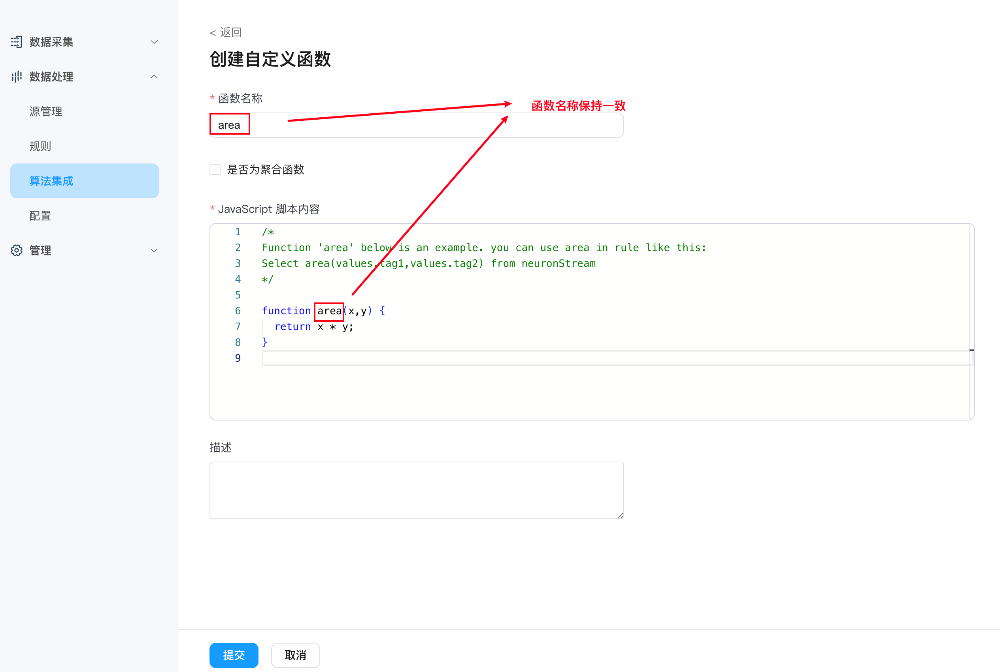

# 自定义 JavaScript 函数

NeuronEX 支持在 Dashboard 上创建自定义 JavaScript 函数。通过创建 JavaScript 函数并在规则中使用，可以快速的实现数据的逻辑计算和格式转换。

## 创建自定义 JavaScript 函数

在 **数据处理 -> 算法集成**页面，选择**自定义函数**选项卡，点击**创建自定义函数**按钮。


输入函数名称和 Javascipt 代码后，即可创建自定义 JavaScript 函数。注意，函数名称必须和函数代码中的主函数名称保持一致。Javascipt 代码中默认提供了示例函数，以及在规则中的使用方式。



## 聚合函数的使用

如果想通过 Javascipt 代码来实现聚合函数的使用，请在创建函数时，将`是否为聚合函数`选项打勾。并且传入 Javascript 函数的参数必须为数组类型， Javascript 函数示例如下：

```javascript
function sum_js(collection){
  
  let sum = 0;
  for (let i = 0; i < collection.length; i++) {
    sum += arr[i];
  }
  return sum; 
}
```

规则中使用，示例如下：

```sql
SELECT sum_js(temperature) FROM stream Group By TumblingWindow(ss, 10)
```