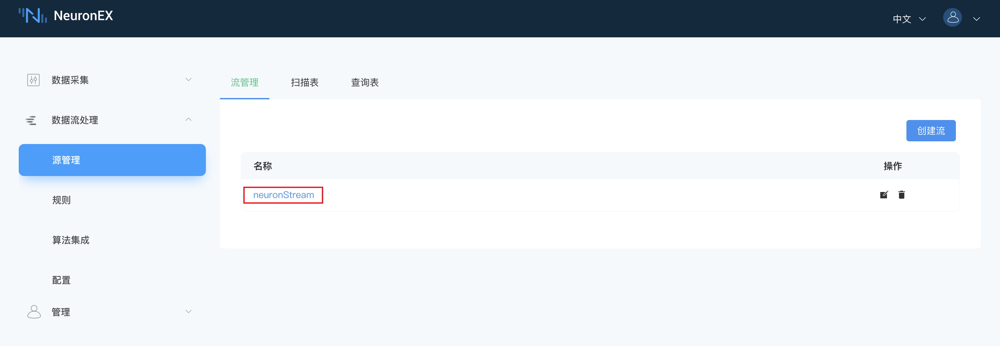
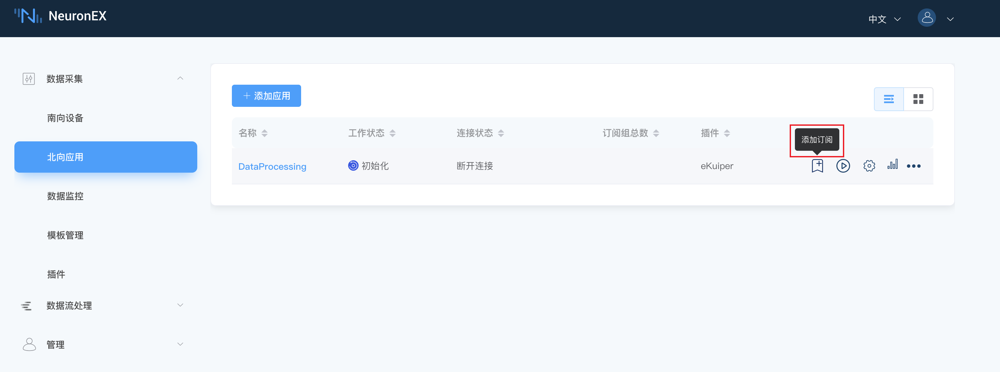

# Neuron 源

<span style="background:green;color:white;">流</span>        <span style="background:green;color:white">扫描表</span>

NeuronEX 数据处理模块通过 `Neuron` 类型的数据源，可以接收来自 NeuronEX 数采模块的数据并通过规则处理分析。


在 NeuronEX **数据流处理** -> **源管理**，在**流管理**页签下，NeuronEX 已经默认配置的 `Neuron` 类型的数据源 neuronStream。




将 NeuronEX 数采模块的数据发送到 neuronStream，需要在 NeuronEX **数据采集** -> **北向应用**页签下，将驱动数据添加订阅到 DataProcessing节点，如下图所示：




然后，用户可直接在 **数据流处理** -> **规则** -> **新建规则** 里，选择 `neuronStream` 作为数据源，进行规则的创建。
```sql

SELECT * FROM neuronStream
```

## 消息格式

数采模块发过来的消息为固定的 json 格式，如下所示： 

```json
{
  "timestamp": 1646125996000,
  "node_name": "node1", 
  "group_name": "group1",
  "values": {
    "tag_name1": 11.22,
    "tag_name2": "string"
  },
  "errors": {},
  "metas":{}
}
```


## 创建流

创建 `Neuron` 类型的流。登录 NeuronEX，点击**数据流处理** -> **源管理**。在**流管理**页签，点击**创建流**。

在弹出的**源管理** / **创建**页面，进入如下配置：

- **流名称**：输入流名称
- **是否为带结构的流**：默认不勾选即可
- **流类型**：选择 neuron。
- **配置组**：可使用默认配置组，如希望自定义配置组，可点击添加配置组按钮，在弹出的对话框中进行如下设置，设置完成后，可点击**测试连接**进行测试：

  - **名称**：输入配置组名称。
  - **路径**：连接 NeuronEX 数采模块服务的 url，默认为tcp://127.0.0.1:7081，需要与 NeuronEX 数采模块的url匹配。
- **流格式**：选择 `json` 格式。
- **共享**：勾选是否共享源，勾不勾选皆可。

:::tip 提示
默认已经配置了一个名为 neuronStream 的 `Neuron` 类型数据源，用户可直接使用。当neuronStream被删除后，可通过上述步骤进行创建。
:::

## 创建扫描表

创建 `Neuron` 类型的扫描表。登录 NeuronEX，点击**数据流处理** -> **源管理**。在**扫描表**页签，点击**创建扫描表**。

- **表名称**：输入表名称
- **是否为带结构的表**：默认不勾选即可
- **表类型**：选择 neuron。
- **配置组**：可使用默认配置组，如希望自定义配置组，可点击添加配置组按钮，在弹出的对话框中进行如下设置，设置完成后，可点击**测试连接**进行测试：

  - **名称**：输入配置组名称。
  - **路径**：连接 NeuronEX 数采模块服务的 url，默认为tcp://127.0.0.1:7081，需要与 NeuronEX 数采模块的url匹配。
- **表格式**：选择 `json` 格式。
- **保留大小**：指定保留大小，默认为1。
