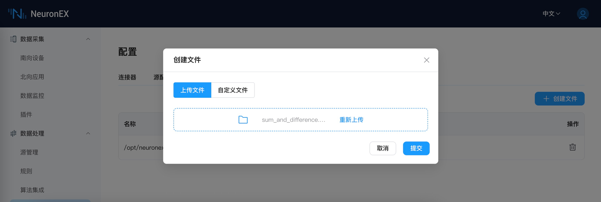
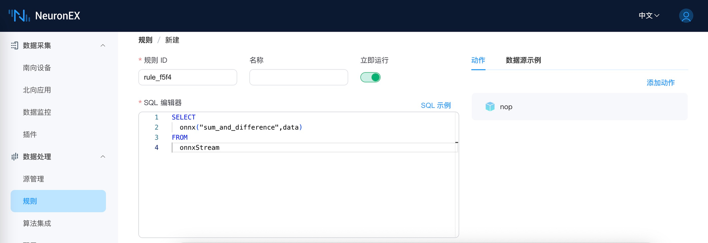

# ONNX 插件使用

ONNX 是一种针对机器学习所设计的开放式的文件格式，用于存储训练好的模型。它使得不同的人工智能框架可以采用相同格式存储模型数据并交互。

通过集成 NeuronEX 和 ONNX，用户只需要上传预先构建的 ONNX 模型， 即可在规则中使用该模型来分析流中的数据。 在本教程中，我们将演示如何通过 NeuronEX 快速调用已预先训练好的 ONNX 模型。

 

## 环境准备​

- NeuronEX 官方 Docker 镜像
    ```shell
    docker pull emqx/neuronex:3.5.0
    ```

- 模型文件

    [sum_and_difference](https://github.com/yalue/onnxruntime_go_examples/blob/master/sum_and_difference/sum_and_difference.onnx)

    `sum_and_difference` 模型主要功能是对输入的数据进行处理，计算输入数据的近似总和以及任意两个输入数据之间的近似最大差值。


- 模型上传

    请自行下载上述模型到本地，然后通过 NeuronEX 的文件上传功能，将上述模型上传到 NeuronEX。如图所示， 点击 `数据处理`-> `配置` → `文件管理`  即可上传文件。

    

 

## 规则编写

在数据处理功能**规则**页面，通过 SQL 规则调用 ONNX 模型，使用上述模型处理数据。函数的第一个参数为不带 onnx 后缀的模型名字（此处不需要添加sum_and_difference.onnx所在的文件路径），第二个参数为待处理的数据。

 
 


## 测试执行

通过向 onnxStream 发送待处理数据，然后观察数据处理结果。待处理数据如下：
```json
{
  "data": [
    0.2,
    0.3,
    0.6,
    0.9
  ]
}
```

处理结果如下：
```json
[{"onnx":[[1.9999883,0.60734314]]}]
```
 

## 其他

本例中，官方发布的 NeuronEX Docker 镜像自带 ONNX 相关的依赖库。如果用户通过deb/rpm 或二进制形式部署 NeuronEX，则需要参考如下步骤手动构建 ONNX依赖环境。

1. 下载 [ONNX 依赖](https://github.com/lf-edge/ekuiper/tree/master/extensions/functions/onnx/lib)。

::: tip
为了方便，可以将所有 .so 文件都下载下来，NeuronEX 会自动选择合适的 .so 文件。
:::

2.在运行 NeuronEX 的机器上新建目录`/usr/local/onnx/lib/`，然后将上述 .so 文件拷贝到目录中。 

