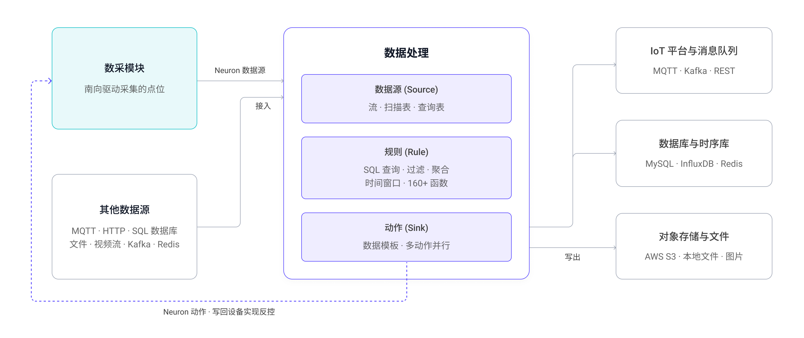

# 数据处理

EMQX Neuron 内置流式计算引擎，在数据离开边缘之前完成过滤、换算、聚合与告警判断。

## 适用场景

南向采集到的数据可由北向应用直接上报，不必经过数据处理。以下情况建议先经规则处理：

- **采集频率远高于业务需要**——100 毫秒采一次是为了不漏掉瞬变，而报表只需要分钟级均值。用时间窗口聚合后上报，数据量可降两个数量级。
- **稳态下数值几乎不变**——设备平稳运行时点位值基本不动。用条件过滤，只在变化超过阈值时上报。
- **告警需要秒级响应**——判断逻辑放在边缘，不必等待云端往返，断网时仍然有效。
- **上报前需要统一单位或字段名**——在边缘做一次，胜过每个下游系统各做一次。

两条路径可以并存，选型依据见[北向应用 · 接入大数据与边缘计算](../configuration/north-apps/analytics.md)。

## 阅读顺序

1. [第一条规则](./first-rule.md)：把数采数据接进来，用一条 SQL 加工后发到 MQTT
2. [数据源 (Source)](./source.md)：定义数据从哪里来，在规则中作为流或表使用
3. [规则](./rules.md)：编写 SQL、添加动作、调试验证
4. [动作 (Sink)](./sink/sink.md)：规则结果写到哪里去

## 与数采模块的连接

数据处理与数采模块之间是双向的，以下两个连接器是产品中最常用的：

| 方向 | 用什么 | 说明 |
| --- | --- | --- |
| 数采 → 规则 | [Neuron 数据源](./neuron.md) | 北向的**规则引擎应用**把订阅的采集组送入 `neuronStream` 流。该应用默认已存在，只需添加订阅，见[规则引擎应用](../configuration/north-apps/ekuiper/overview.md) |
| 规则 → 设备 | [Neuron 动作](./sink/neuron.md) | 规则结果通过南向驱动写回设备，构成「采集 → 判断 → 控制」的边缘闭环 |

## 数据源

数据源定义与外部系统的连接方式。创建后只是一个逻辑定义，只有引用它的规则启动后，数据才真正流动。同一个定义可被多条规则的 `FROM` 子句使用。

在规则中，数据源可作为[流 (Stream)](./stream.md) 或[表 (Table)](./tables.md) 使用：流有数据流入即触发计算；表表示流的当前状态，用于批处理，分[扫描表](./scan.md)和[查询表](./lookup.md)两种。

解码方式由 `format` 属性指定，支持 `json`、`binary`、`protobuf`、`delimited`，也可设为 `custom` 使用自定义格式。

| 
类型
 | 用途 |
| --- | --- |
| [Neuron](./neuron.md) | 数采模块采集的点位数据 |
| [MQTT](./mqtt.md) | 订阅 MQTT 主题 |
| [HTTP Pull](./http_pull.md) | 定时从 HTTP 服务拉取 |
| [HTTP Push](./http_push.md) | 内置 HTTP Server，接收客户端推送 |
| [内存](./memory.md) | 接收上一条规则的输出，构成规则流水线 |
| [SQL](./sql.md) | 从 MySQL、PostgreSQL、SQL Server、Oracle、SQLite 查询 |
| [文件](./file.md) | 读取文件内容 |
| [Video](./video.md) | 拉取视频流 |
| [Simulator](./simulator.md) | 内置模拟数据，用于调试规则 |
| [Redis](./redis.md) | 从 Redis 读取 |
| [CAN](./can.md) | 连接 CAN 总线读取 |
| [Kafka](./kafka.md) | 消费 Kafka Topic |
| [WebSocket](./websocket.md) | 从 WebSocket 接收 |

## 动作 (Sink)

一条规则可以有多个动作，同一类型也可重复使用。结果输出前可经[数据模板](./sink/data_template.md)做二次处理；不配置数据模板时，规则结果直接输出。

| 
类型
 | 用途 |
| --- | --- |
| [MQTT](./sink/mqtt.md) | 发布到外部 MQTT 服务 |
| [Neuron](./sink/neuron.md) | 写回设备，实现反控 |
| [REST](./sink/rest.md) | 调用外部 HTTP 接口 |
| [内存](./sink/memory.md) | 传给下一条规则，构成规则流水线 |
| [Log](./sink/log.md) | 写入日志，通常仅用于调试 |
| [SQL](./sink/sql.md) | 写入关系型数据库 |
| [InfluxDB V1](./sink/influx.md) / [V2](./sink/influx2.md) | 写入时序数据库 |
| [文件](./sink/file.md) | 写入文件 |
| [Kafka](./sink/kafka.md) | 写入 Kafka Topic |
| [Redis](./sink/redis.md) | 写入 Redis |
| [AWS S3](./sink/aws-s3.md) | 上传到对象存储 |
| [Image](./sink/image.md) | 保存为图片文件 |
| [Nop](./sink/nop.md) | 不输出，用于性能测试 |

## SQL 能力

| 能力 | 说明 | 详见 |
| --- | --- | --- |
| 查询与转换 | 抽取、转换、过滤、排序、分组、聚合，以及 LEFT / RIGHT / FULL / CROSS 连接 | [查询语句](./sqls/query_language_elements.md) |
| 函数 | 160+ 个，覆盖数学、字符串、聚合、哈希、时间日期、JSON、数组、对象与分析函数 | [函数](./sqls/functions/overview.md) |
| 窗口 | 滚动、跳跃、滑动、会话四类时间窗口，以及计数窗口 | [窗口](./sqls/windows.md) |
| 自定义扩展 | SQL 表达不了的逻辑，可用 Python、C/C++、JavaScript 扩展，或注册外部 REST 服务 | [算法集成](./extension.md) |

## 规则的运行方式

- 规则启动后持续运行，直到手动停止；发生错误或实例退出时会异常停止。
- 规则之间相互隔离，一条规则出错不影响其他规则；但共享同一份硬件资源，可为每条规则指定算子缓冲区以限制处理速度。
- 多条规则可以串成流水线，通过[内存](./memory.md) Source/Sink 或 MQTT Source/Sink 连接，见[规则流水线](./rule_pipeline.md)。
- 创建规则时可开启[规则调试](./rule_test.md)，实时查看 SQL、函数和数据模板的输出是否符合预期。

## 配置

[配置](./config.md)页面管理[连接器](./config.md#连接器)（连接复用）、[模式](./config.md#模式)（Protobuf 等解码格式）以及文件管理。
