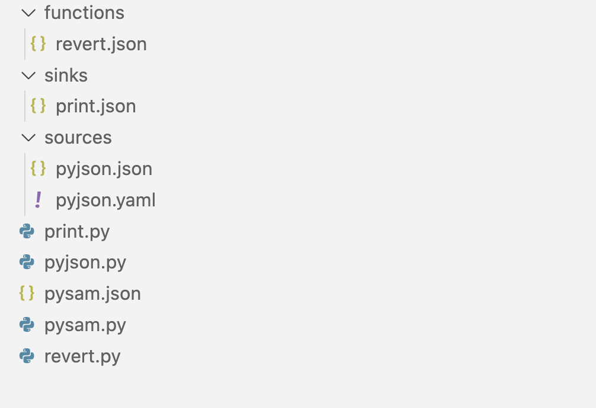
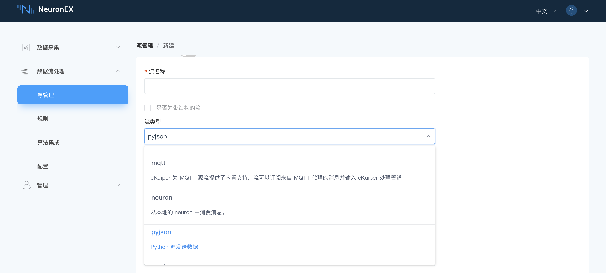
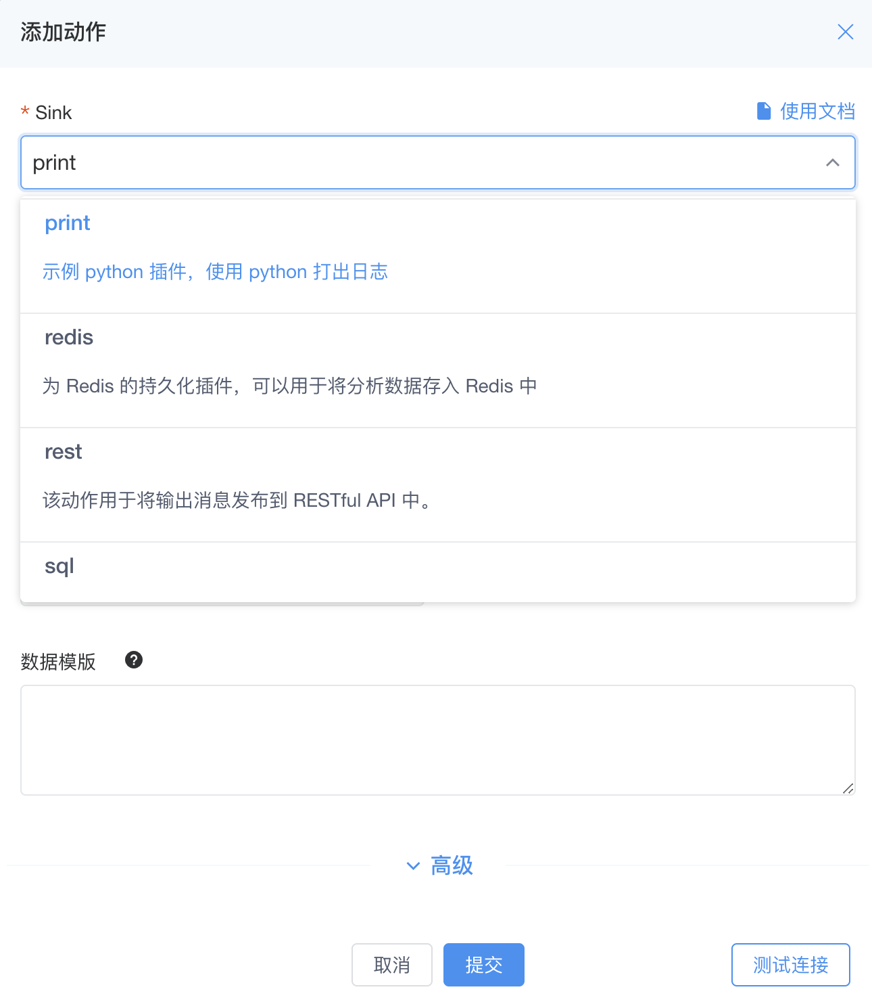

# Python 便携插件扩展示例

以下为pysam插件示例的介绍及打包过程，pysam插件可通过该链接[python sdk example](https://github.com/lf-edge/ekuiper/tree/master/sdk/python)下载获取及测试。

## 部署要求
使用Python 便携插件，需要有 Python3 环境。
- 如果您通过安装包的方式安装 NeuronEX ，则需要
  
  1. 手动安装 python 3.x 环境。
  2. 通过 pip 安装`ekuiper`和`pynng`库
  ```shell
  pip install ekuiper pynng
  ```

- 如果您通过 docker 的方式安装 NeuronEX ，请使用[neuronex:3.x.x-python](../installation/docker.md#docker-容器-python-运行环境)类型的 NeuronEX 镜像，该镜像已经包含了 Python3 环境，以及一些相关的函数库。

## pysam插件整体介绍

pysam插件的目录内包含如下文件：

- `pysam.json`：必需，插件元数据文件，用于描述插件的元数据信息。
- `pysam.py`：必需，插件主程序可执行文件。
- `pyjson.py`：可选，插件中的一个数据源Source插件。
- `sources文件夹、pyjson.json、pyjson.yaml`：可选，插件中的数据源Source插件`pyjson.py`的配置信息。
- `print.py`：可选，插件中的一个动作Sink插件。
- `sinks文件夹、print.json`：可选，插件中的动作Sink插件`print.py`的配置信息。
- `revert.py`：可选，插件中的一个函数Function插件。
- `functions文件夹、revert.json`：可选，插件中的函数Function插件`revert.py`的配置信息。



::: tip 提示
一个插件可以包含一个或多个数据源Source、动作Sink和函数Function插件，在pysam示例中包含了一个数据源Source插件`pyjson`、一个动作Sink插件`print`和一个函数插件`revert`。
:::

## 插件元数据文件介绍
`pysam.json`文件是插件的元数据文件，用于描述插件的元数据信息。以下是元数据文件中的关键信息介绍：
- `language`：该字段指定了插件实现的语言，插件必须以单一语言实现，python类型插件填入`python`。
- `executable`：字段需要指定了插件主程序可执行文件的名称。在本例中为`pysam.py`文件。
:::tip 提示
此`pysam.py`文件名并不必需要与插件的元数据文件`pysam.json`重名。比如可在`executable`字段填入`main.py`，将`pysam.py`重命名为`main.py`亦可。
:::
- `sources`：该字段为数组格式，包含了插件中的所有数据源Source插件信息。
- `sinks`：该字段为数组格式，包含了插件中的所有动作Sink插件信息。
- `functions`：该字段为数组格式，包含了插件中的所有函数Function插件信息。

```json
{
  "version": "v1.0.0",
  "language": "python",
  "executable": "pysam.py",
  "sources": [
    "pyjson"
  ],
  "sinks": [
    "print"
  ],
  "functions": [
    "revert"
  ]
}
```
:::tip 提示
`pysam.json`文件是插件的元数据文件,文件名称`pysam`必须与 NeuronEX Dashboard上**数据流处理** -> **扩展** -> **便携插件**页签上，点击**创建便携插件**时填入的`插件名称`相同。
:::


## 插件主程序介绍
在该示例中，`pysam.py`文件是插件的主程序可执行文件，该文件中包含了插件的主程序逻辑，将具体的数据源Source、动作Sink和函数Function插件进行插件配置及注册。

```python
from ekuiper import plugin, PluginConfig
from print import PrintSink
from pyjson import PyJson
from revert import revertIns

if __name__ == '__main__':
    c = PluginConfig("pysam", {"pyjson": lambda: PyJson()}, {"print": lambda: PrintSink()},
                     {"revert": lambda: revertIns})
    plugin.start(c)
```

## 具体插件实现介绍

在该示例中，`pyjson.py`文件是插件中的一个数据源Source插件，`print.py`文件是插件中的一个动作Sink插件，`revert.py`文件是插件中的一个函数Function插件。以函数Function插件`revert.py`为例,通过在`revert.py`文件中的`exec`函数，实现自定义的功能需求。
    
```python

from typing import Any, List
from ekuiper import Function, Context

class RevertFunc(Function):

    def __init__(self):
        pass

    def validate(self, args: List[Any]):
        return ""

    def exec(self, args: List[Any], ctx: Context):
        return args[0][::-1]

    def is_aggregate(self):
        return False

revertIns = RevertFunc()
```

## 插件打包及安装

在完成插件开发后，我们需要将结果打包成zip进行安装。在`pysam.json`的同级目录下，执行以下命令进行打包：

```shell
zip -r pysam.zip ./*

```
通过以上命令，将会在当前目录下生成`pysam.zip`文件，该文件即为我们需要安装的插件包，在**便携插件**页签，点击**创建便携插件**。在弹出的窗口输入插件名称`pysam`,上传插件`pysam.zip`，即可完成插件的安装。

插件安装完成后，会在插件列表显示插件的详细信息，如下：


::: tip 提示
在安装完插件后，NeuronEX不需要重启，即可正常使用插件功能。
:::

## 插件使用示例

### 在数据源Source中使用插件
在**源管理**页面，点击**创建流**，即可选择**pysam**插件作为自定义数据源使用。


### 在SQL中使用插件

在**规则**页面，点击**新建规则**，即可在规则SQL中直接调用自定义函数`revert`,在该示例中，`revert`函数从`demoStream`流中获取`device_name`字段的值，并实现了字符串反转的功能输出到`result`字段。

```sql
SELECT revert(device_name) as result FROM demoStream
```
假设`demoStream`流中的输入数据如下：
```json
{
  "device_name": "abcdefg"
}

```
则，规则输出数据如下：
```json
{
  "result": "gfedcba"
}

```

### 在动作Sink中使用插件

在**添加动作**页面，即可选择**print**插件作为自定义动作使用。



## 其他

### 其他插件可选项
用户可以在插件目录下添加`install.sh`文件以及`requirements.txt`文件，插件在安装时，会自动执行`install.sh`脚本,安装插件所需的依赖库。

`install.sh`文件示例如下：

```shell
cur=$(dirname "$0")
echo "Base path $cur"
pip install -r $cur/requirements.txt
echo "Done"
```

`requirements.txt`文件示例如下：

```shell
numpy==1.22.3
scipy==1.8.0
```

::: tip 提示
用户可以在插件目录下添加相应的算法模型文件，如`model.pkl`文件，在插件python代码中可直接调用该模型文件。
:::
