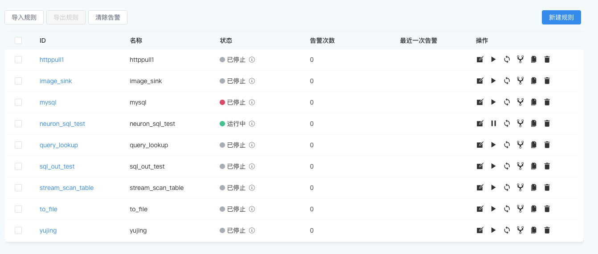
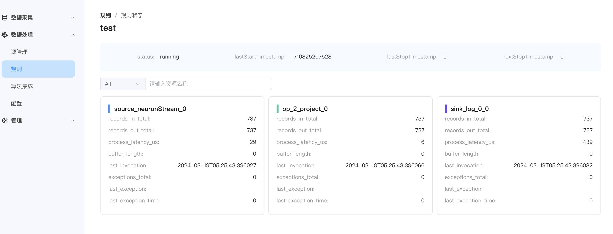

# 规则管理

我们可以在规则页面对规则进行管理，包括对规则进行操作、导入规则、查看规则状态信息等。

## 查看规则信息

- **ID**
  
  规则的唯一标识符，由用户自定义。

- **名称**

  对规则的描述，由用户自定义。

- **状态**

  规则的运行状态，包括 `运行中`、`已停止`。

- **告警次数**
  
    规则运行过程中的告警次数。

- **最后一次告警**
    
    规则运行过程中最后一次的告警信息。

- **操作**

  包括规则的`编辑`、 `启停`、`重启`、`拓扑`、`复制`及`删除`。

## 了解规则运行的状态指标

当一条规则在 NeuronEX 中运行后，我们可以通过规则指标来了解到当前的规则运行状态。点击规则的 `状态` 即可查看规则的状态信息，如下所示:

其中 `status` 代表了 rule 当前的运行状态，`running` 代表规则正在运行。

而之后的监控项则代表了规则运行过程中，各个算子的运行情况，其监控项构成则为 `算子类型_算子信息_算子索引_具体监控项`。

以 `source_neuronStream_0_records_in_total` 为例，其中 `source` 代表了读数据算子，`neuronStream` 为对应的 stream，`0` 代表了该算子实例在并发度中的索引，而 `records_in_total` 则诠释了实际的监控项，即该算子接收了多少条记录。

