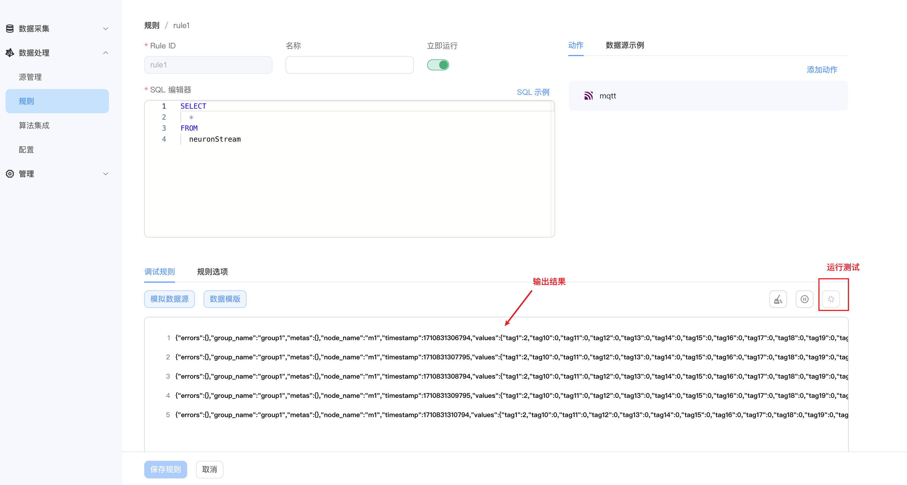
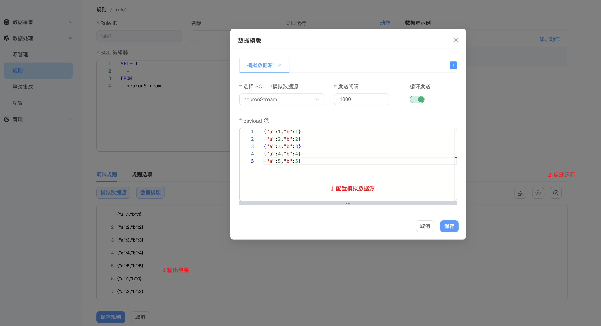
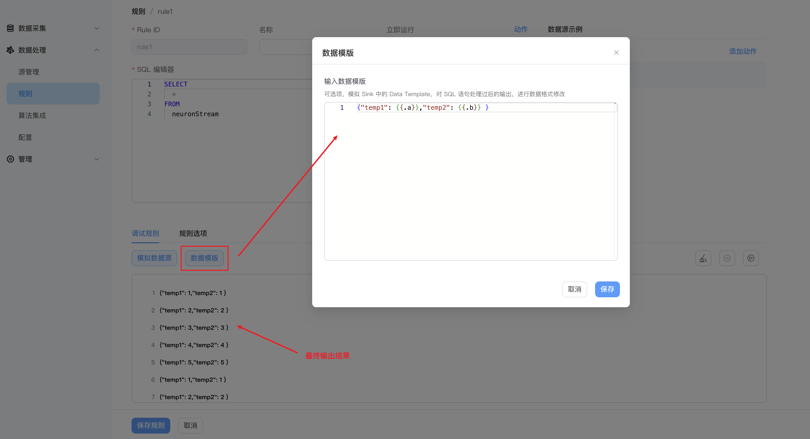

# 规则调试

在规则创建时，开启规则调试功能，可以实时查看数据源接入后，经过 SQL 处理后的规则输出结果，可以快速对 SQL 语法、内置函数以及数据模板等内容进行测试验证，是否符合预期输出结果。

同时，还支持模拟数据源规则调试，将 SQL 编辑器内的原始数据源替换为自定义的模拟数据源，提供了更加灵活的数据源模拟方式。


## 开启调试

如果 SQL 编辑器中的数据源有数据流入，可直接点击下图中`运行测试`按钮，启动规则调试，将会直接在当前界面看到规则调试输出。



## 开启模拟数据源调试

如果 SQL 编辑器中的数据源没有数据流入，仍然想进行规则调试，可开启模拟数据源。
- 选择 SQL 中模拟数据源：选择在 SQL 编辑器中的数据源
- 发送间隔：模拟数据源的发送间隔
- 循环发送：是否循环发送
- payload：发送的 JSON 数据内容

payload模拟数据支持“多行一条 json ”、“单行一条 json ”，“有多行单行一条 json ”。

  - 多行一条 json
  ```json
  {
    "ts" : 1672545661000,
    "tag1" : "area1",
    "value1" : 123
  }
  ```
  - 单行一条 json
  ```json
  {"ts" : 1672545661000, "tag1" : "area1", "value1" : 1}
  ```
  - 有多行单行一条 json
  ```json
  {"ts" : 1672545661000, "tag1" : "area1", "value1" : 1}
  {"ts" : 1672545662000, "tag1" : "area1", "value1" : 2}
  {"ts" : 1672545663000, "tag1" : "area1", "value1" : 3}
  {"ts" : 1672545664000, "tag1" : "area1", "value1" : 4}
  {"ts" : 1672545665000, "tag1" : "area1", "value1" : 5}
  ```

下图介绍了模拟数据源的配置及输出示例：




## 数据模板配置

`数据模板`模拟 Sink 中的数据模板，对 SQL 语句处理过后的结果，进行数据格式修改后再输出。下图介绍了基于上一步开启模拟数据源的配置后，增加数据模板的输出结果示例：



更多数据模板的用法，请参见[数据模板](./sink/data_template.md)。