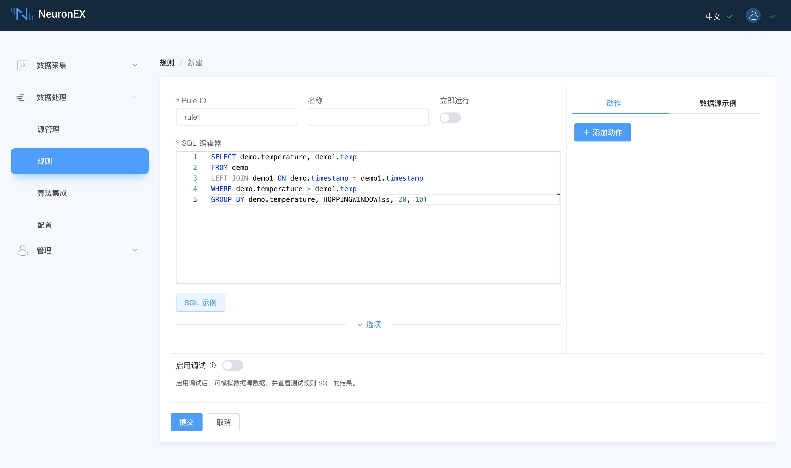
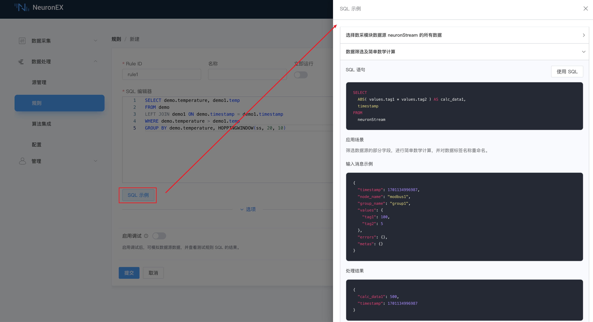
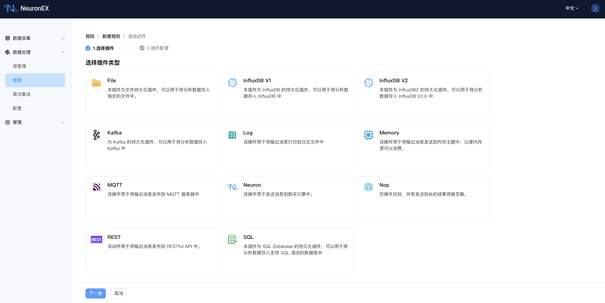
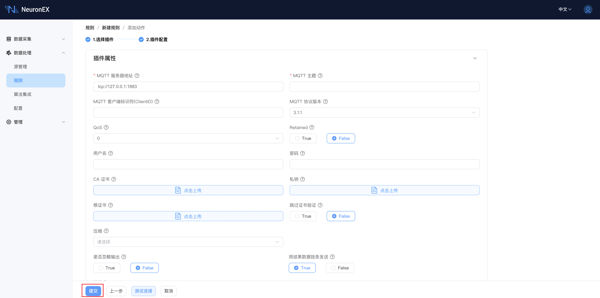
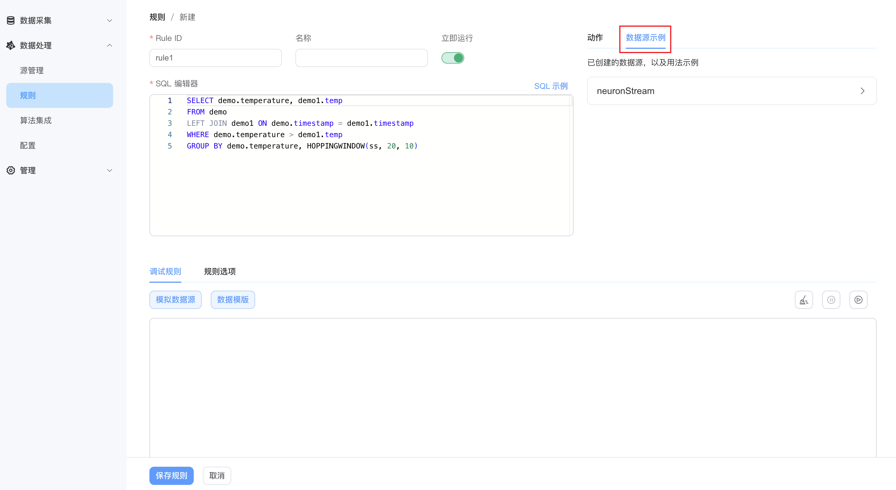
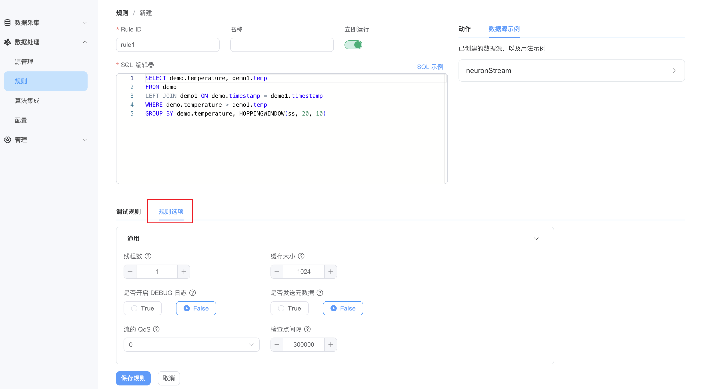
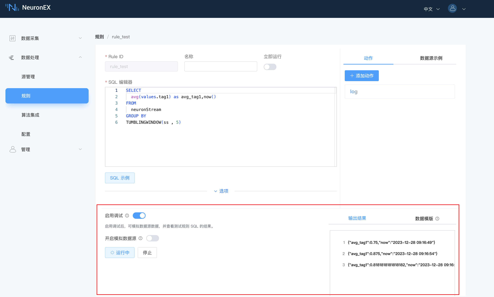
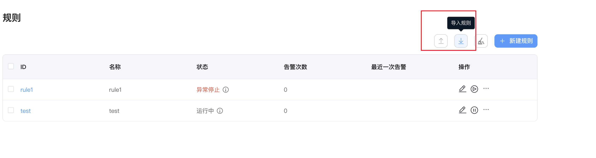
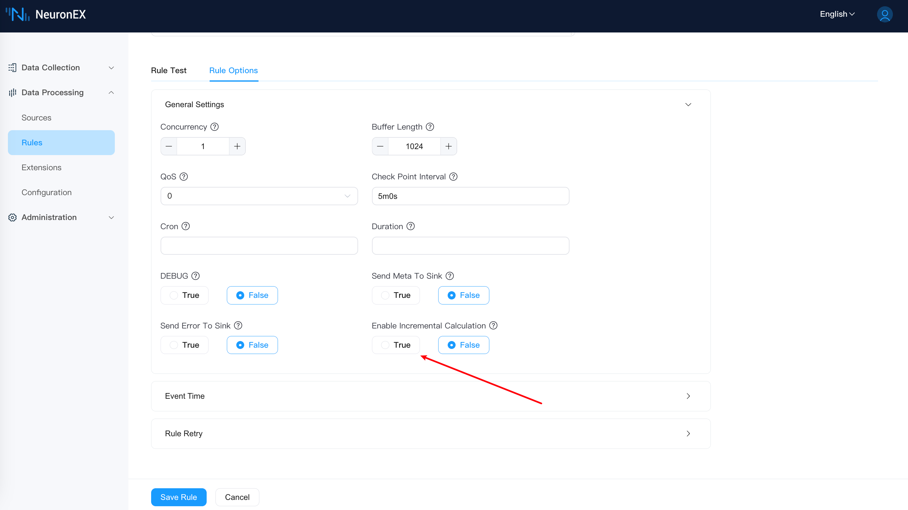

# 规则


在 NeuronEX 中通过 **规则(Rule)** 处理所有计算逻辑。规则以数据源作为输入，通过 **SQL** 定义计算逻辑，将结果输出到 **动作(Sink)** 中。规则定义提交后，它将持续运行。它将不断从源获取数据，根据 SQL 逻辑进行计算，并根据结果实时触发 **动作(Sink)**。

NeuronEX 支持同时运行多个规则。这些规则在同一个内存空间中运行，共享相同的硬件资源。多条并行规则在运行时上是分开的，某条规则的错误不会影响其他规则。

::: tip

NeuronEX 规则 SQL 中至少有一个数据源应该是`流(Stream)`类型。关于如何创建流，可参考 [数据流 - Stream](./stream.md)。

:::


## 创建规则

在 NeuronEX dashboard 界面，点击**数据处理** -> **规则**。点击**创建规则**按钮：

- 规则 ID：输入规则 ID，规则 id 在同一 NeuronEX 实例中必须唯一。

- 名称：输入规则名称

- 立即运行：如开启，规则创建后将立即运行。

- 输入规则 SQL，例如

  ```sql
  SELECT demo.temperature, demo1.temp
  FROM demo
  LEFT JOIN demo1 ON demo.timestamp = demo1.timestamp
  WHERE demo.temperature > demo1.temp
  GROUP BY demo.temperature, HOPPINGWINDOW(ss, 20, 10)
  ```



## 规则 SQL

规则`sql` 中定义了要处理的流或表，以及如何处理。规则 SQL 是，并将处理结果发送到一个或多个动作(Sink)。规则`sql` 中可以使用内置函数和运算符，也可以使用自定义函数和算法。

最简单的规则 SQL 如 `SELECT * FROM neuronStream`，这条规则会从 `neuronStream` 数据流中获取所有数据。 NeuronEX 提供的丰富的运算符和函数，更多用法请参见 [SQL](./sqls/overview.md) 章节 。

点击**SQL 示例**按钮，查看常用 SQL 示例，将展示 SQL 语句、应用场景、输入消息示例和处理结果。



## 添加 动作(Sink)

动作(Sink)部分定义了一个规则的输出行为。每个规则可以有多个动作。

- 在**动作**区域，点击**添加动作**按钮。


- 选择动作插件类型



- 填写插件配置，并提交




::: tip
动作用来向外部系统写入数据，您可前往 [动作(Sink)](./sink/sink.md) 页面获取详细的配置信息。
:::

## 数据源示例
可查看已创建的数据源，以及用法示例。



## 规则选项 (可选)

点开**选项**部分，可继续对当前规则进行配置：

| 选项名                | 类型和默认值     | 说明                                                                                             |
|--------------------|------------|------------------------------------------------------------------------------------------------|
| 线程数        | int: 1     | 一条规则运行时会根据 sql 语句分解成多个 plan 运行。该参数设置每个 plan 运行的线程数。该参数值大于1时，消息处理顺序可能无法保证。                      |
| 缓存大小       | int: 1024  | 指定每个 plan 可缓存消息数。若缓存消息数超过此限制，plan 将阻塞消息接收，直到缓存消息被消费使得缓存消息数目小于限制为止。此选项值越大，则消息吞吐能力越强，但是内存占用也会越多。 |
| 是否开启Debug日志              | bool:false | 指定该条规则是否开启 Debug Level 的日志水平，缺省情况下会继承全局配置中的 Debug 配置参数。                                        |
| 是否发送元数据     | bool:false | 指定是否将事件的元数据发送到目标。 如果为 true，则目标可以获取元数据信息。                                                       |
| 是否使用事件时间        | bool:false | 使用事件时间还是将时间用作事件的时间戳。 如果使用事件时间，则将从有效负载中提取时间戳。 必须通过**数据流**定义指定时间戳。    |
| 事件时间延迟      | int64:0    | 在使用事件时间窗口时，可能会出现元素延迟到达的情况。 LateTolerance 可以指定在删除元素之前可以延迟多少时间（单位为 ms）。 默认情况下，该值为0，表示后期元素将被删除。   |
| 流的QoS                | int:0      | 指定流的 qos。 值为0对应最多一次； 1对应至少一次，2对应恰好一次。 如果 qos 大于0，将激活检查点机制以定期保存状态，以便可以从错误中恢复规则。                 |
| 检查点间隔 | int:300000 | 指定触发检查点的时间间隔（单位为 ms）。 仅当 qos 大于0时才有效。                                                          |
| 最大重试次数     | int: 0     | 最大重试次数。如果设置为0，该规则将立即失败，不会进行重试。                              |
| 重试间隔时间        | int: 1000  | 默认的重试间隔时间，以毫秒为单位。如果没有设置 `multiplier`，重试的时间间隔将固定为这个值。        |
| 重试最大间隔时间     | int: 30000 | 重试的最大间隔时间，单位是毫秒。只有当 `multiplier` 有设置时，从而使得每次重试的延迟都会增加时才会生效。 |
| 重试间隔时间乘数   | float: 2   | 重试间隔时间的乘数。                                                  |
| 随机值系数 | float: 0.1 | 添加或减去延迟的随机值系数，防止在同一时间重新启动多个规则。                              |


:::tip 提示
大多数场景下，规则选项采用默认值即可。
:::

完成设置后，点击**提交**，完成当前规则的创建。新建规则将出现在规则列表中。您可在此查看规则状态、编辑规则、停止规则、刷新规则、查看规则拓扑图，复制规则或删除规则。




## 规则调试

在规则创建时，开启规则调试功能，可以实时查看数据源接入后，经过 SQL 处理后的规则输出结果，可以快速对 SQL 语法、内置函数以及数据模板等内容进行测试验证，是否符合预期输出结果。

同时，还支持模拟数据源规则调试，将 SQL 编辑器内的原始数据源替换为自定义的模拟数据源，提供了更加灵活的数据源模拟方式。

详情请参见[规则调试](./rule_test.md)。




## 导入导出规则

在 NeuronEX Dashboard 界面，点击**数据处理** -> **规则**。点击**导入规则**按钮。在弹出的窗口中，您可选择：

- 直接贴入文件内容
- 通过上传文件的形式导入文件内容

点击**提交**后，新建规则将出现在规则列表中。您可在此查看规则状态、编辑规则、停止规则、刷新规则、查看规则拓扑图，复制规则或删除规则。

::: tip

导入规则时，如果有相同 ID 的规则存在，将会覆盖原有规则。

:::

在 NeuronEX Dashboard 界面，点击**数据处理** -> **规则**，点击**导出规则**按钮，将会导出当前规则的 JSON 文件。


## [规则管理](./rule_status.md)

当一条规则运行后，我们可以在规则列表页查看规则的运行状态、告警信息，也可以通过规则指标来了解到当前的[规则运行状态](./rule_status.md#了解规则运行的状态指标)。详情请参见[规则管理](./rule_status.md)。

## [规则流水线](./rule_pipeline.md)

多个规则可以通过指定 sink /源的联合点形成一个处理管道。例如，第一条规则在内存 sink 中产生结果，其他规则在其内存源中订阅该主题。更多用法请参见[规则流水线](./rule_pipeline.md)章节 。

## 增量计算

在使用数据处理功能对窗口内的数据进行聚合函数计算时，默认实现方法是将源源不断的流数据按照窗口定义切分成窗口，并缓存在内存中。当窗口结束后，再将窗口内的所有数据进行聚合计算。该方法所带来的一个问题是当数据还未被聚合计算时，缓存在内存里容易造成内存放大，引起 OOM 问题。详细增量计算介绍请参考[增量计算](https://ekuiper.org/docs/zh/latest/guide/rules/incremental.html)

如要在规则中开启增量计算，请在规则选项中开启增量计算。

