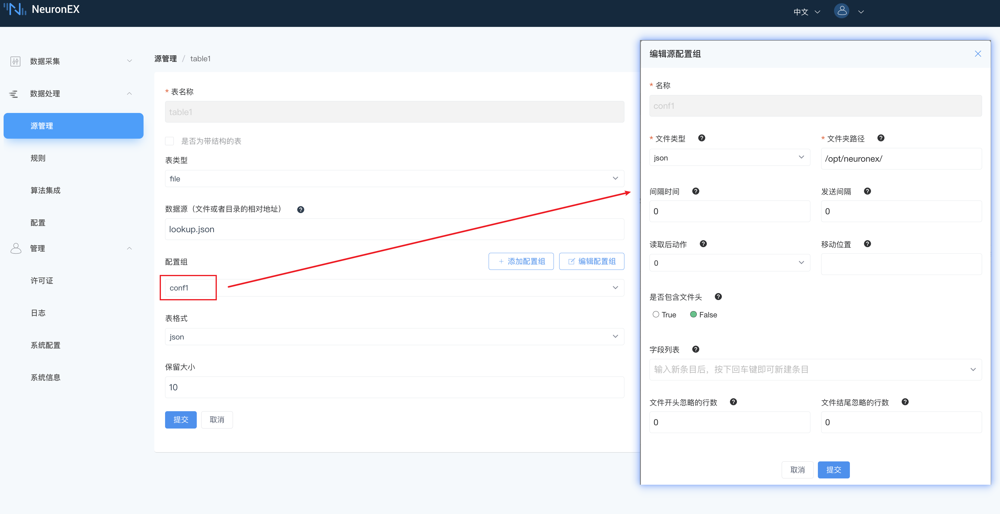
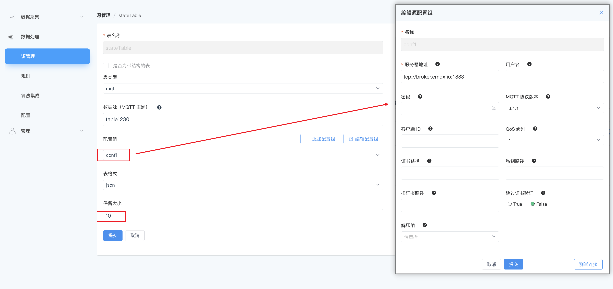
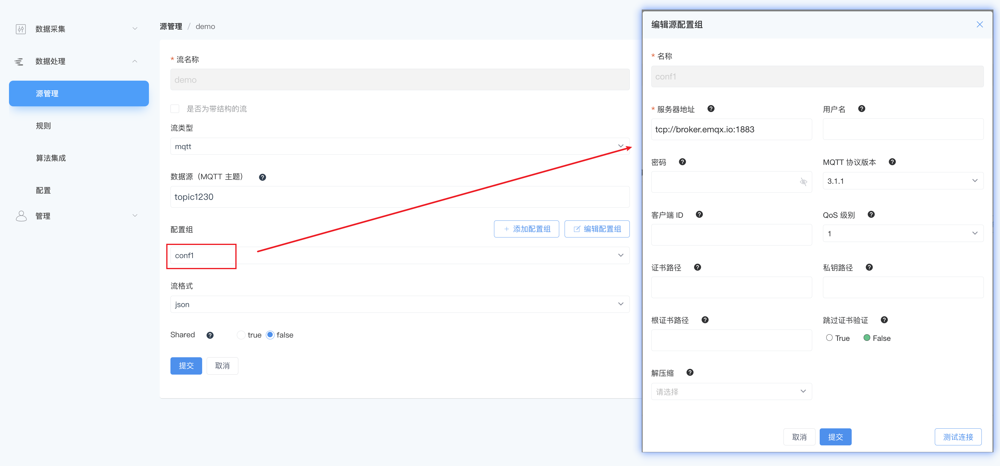
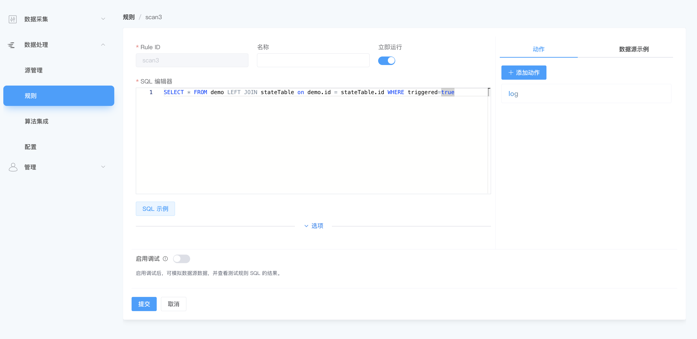

# 扫描表

通常，表将与带有或不带有窗口的流连接。与流连接时，表数据不会影响下游更新数据，它被视为静态引用数据，尽管它可能会在内部更新。

## 数据补全

在这个例子中，创建了一个表 `table1` 来从文件 **lookup.json** 中读取 json 数据。



**lookup.json** 文件的内容是一个对象数组。并放置在了`/opt/neuronex/lookup.json`目录下
```json
[
  {
    "id": 1,
    "name": "device1"
  },
  {
    "id": 2,
    "name": "device2"
  },
  {
    "id": 3,
    "name": "device3"
  }
]
```

然后创建一个规则，在规则中，将 `table1` 与流 `demo` 连接起来，以便流可以从 id 中查找名称。
```sql
SELECT * FROM demo INNER JOIN table1 on demo.id = table1.id
```


`demo`数据流中的数据输入，如下：
```json
{
    "id": 1,
    "value": 78
}

```

则经过该规则处理后的输入，如下：
```json
{
    "id": 1,
    "name": "device1",
    "value": 78
}

```

## 按历史状态过滤

在某些情况下，我们可能有一个用于数据的事件流和另一个作为控制信息的事件流。
在这个例子中，创建了一个表 stateTable 来从 MQTT Broker 的主题 `table1230` 中读取 json 数据。这个表存储作为控制信息的数据。


创建了一个流 demo 来从 MQTT Broker 的主题 `topic1230` 中读取 json 数据。这个流实时接收数据流。



然后创建一个规则，在规则中，将 `stateTable` 与流 `demo` 连接起来，以下 SQL 表示，将根据`stateTable`表中存储的`id`和`triggered`字段，来过滤`demo`流中的数据,只有当`triggered`为`true`时，才会将数据流输出。
```sql
SELECT * FROM demo LEFT JOIN stateTable on demo.id = stateTable.id WHERE triggered=true
```



通过向 MQTT Broker的主题 `table1230`发送json数据，分两次向`stateTable`表中存入数据，如下：
```json
{
    "id": 1,
    "triggered": true
}
```
```json
{
    "id": 2,
    "triggered": false
}
```

通过向 MQTT Broker的主题 `topic1230`发送json数据，当`demo`数据流中的数据输入，如下：
```json
{
    "id": 1,
    "value": 78
}

```
则经过该规则处理后的输入，如下：
```json
{
    "id": 1,
    "triggered": true,
    "value": 78
}

```

当`demo`数据流中的数据输入，如下：
```json
{
    "id": 2,
    "value": 78
}

```
则经过该规则处理后，由于`stateTable`表中的`id`为2时，`triggered`为`false`，所以不会输出数据。
