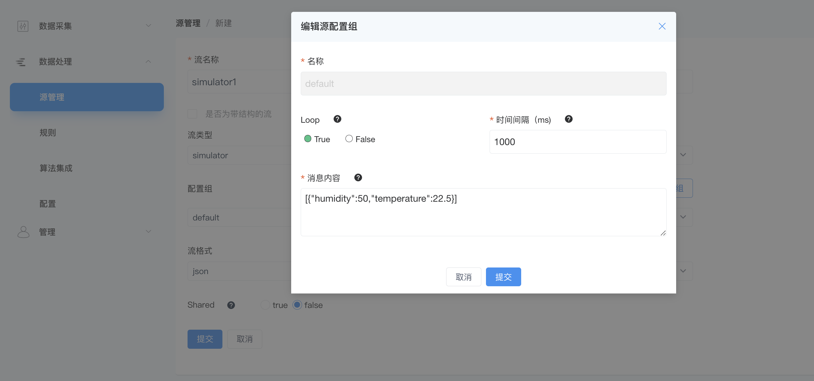

# Simulator 源

流
扫描表

NeuronEX 数据处理模块通过 `Simulator` 类型的数据源，可以生成模拟数据，在创建或更新规则时，提供测试数据源。

## 创建流

登录 NeuronEX，点击**数据流处理** -> **源管理**。在**流管理**页签，点击**创建流**。

在弹出的**源管理** / **创建**页面，进入如下配置：

- **流名称**：输入流名称
- **是否为带结构的流**：不勾选。
- **流类型**：选择 simulator
- **配置组**：可编辑使用默认配置组，或点击添加配置组，在弹出的对话框中进行如下设置

  - **名称**：输入配置组名称。
  - **Loop**：如果设置为 true，则会循环发送 data 中定义的多条 json 数据。
  - **间隔时间**：发出请求的时间间隔（毫秒） 。
  - **消息内容**：自定义 json 格式消息内容，支持定义多条 json 消息。如单条 json 数据 [{"a": 1}]，多条 json 数据 [{"a": 1}, {"b": 1}]。

  ::: tip 提示 
  消息内容必须输入为数组格式，即使只有一条数据。比如：[{"humidity":50,"temperature":22.5}]
  :::

- **流格式**：选择 json 格式。
- **共享**：勾选确认是否共享源。

