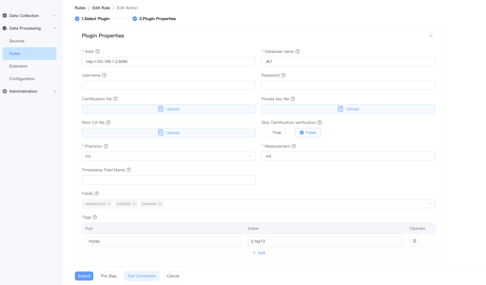
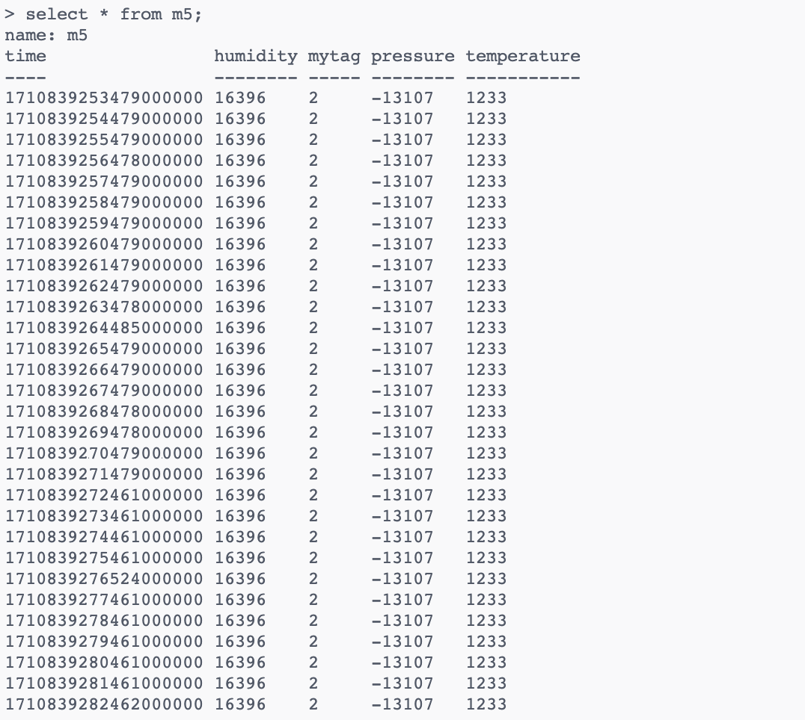

# InfluxDB V1 Sink

该插件将分析结果发送到 InfluxDB V1 中。

## 属性

| 属性名称     | 是否可选 | 说明                      |
| ------------ | -------- | ------------------------- |
| 地址         | 否       | InfluxDB 的地址           |
| 数据库名      | 否       | InfluxDB 数据库名称       |
| 用户名     | 是       | InfluxDB 登陆用户名       |
| 密码     | 是       | InfluxDB 登陆密码         |
| measurement  | 否       | InfluxDB 的测量（数据表名） |
| 时间精度  | 否       | 数据存储时间精度 |
| 时间戳字段名  | 是       | 时间戳字段名称 |
| Fields     | 是       | InfluxDB 的标签值         |
| 标签       | 是       | InfluxDB 的标签键         |


其他通用的 sink 属性也支持，请参阅[公共属性](./sink.md#公共属性)。

## 示例

- 经过 SQL 处理过后的数据格式如下：

```json
{
  "temperature":1233,
  "humidity":16396,
  "pressure":-13107,
  "tag1":2
}
```


- InfluxDB V1 Sink 配置



-  InfluxDB 数据库结果

