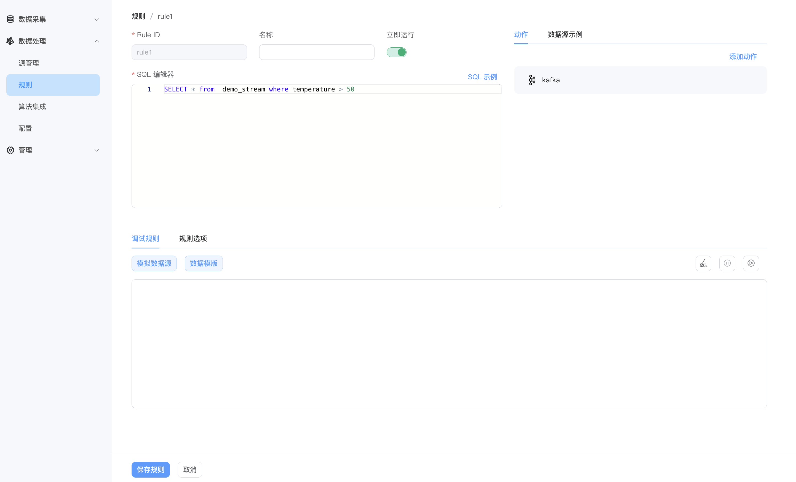
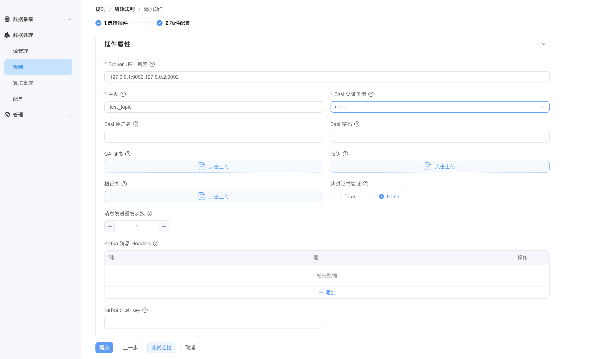

# Kafka 目标（Sink）

该插件将分析结果发送到 Kafka 中。


## 属性

| 属性名称     | 是否可选 | 说明                                    |
| ------------ | -------- | --------------------------------------- |
| Broker URL 列表      | 否       | broker地址列表 ,多个broker地址用 "," 分割            |
| 主题        | 否       | kafka 主题                              |
| Sasl 认证类型 | 否       | sasl 认证类型 , 支持 none，plain，scram |
| Sasl 用户名 | 是       | sasl 用户名                             |
| Sasl 密码 | 是       | sasl 密码                               |


其他通用的 sink 属性也支持，请参阅[公共属性](./sink.md#公共属性)。

## 示例用法

从`demo_stream`数据源中选择温度大于 50 度的数据，转发存储到 Kafka。

- 规则配置



- kafka sink 配置




## 注意事项

如果通过 docker compose 将 NeuronEX 与 kafka 部署在同一容器网络中，可在 NeuronEX 中通过 kafka 主机名配置 brokers 地址。
但是 kafka 需要特别注意 `` KAFKA_CFG_ADVERTISED_LISTENERS `` 需要配置为主机 IP 地址, 如下所示

```yaml
    zookeeper:
     image: docker.io/bitnami/zookeeper:3.8
     hostname: zookeeper
     container_name: zookeeper
     ports:
      - "2181:2181"
     volumes:
      - "zookeeper_data:/bitnami"
     environment:
       - ALLOW_ANONYMOUS_LOGIN=yes
    kafka:
     image: docker.io/bitnami/kafka:3.4
     hostname: kafka
     container_name: kafka
     ports:
      - "9092:9092"
     volumes:
      - "kafka_data:/bitnami"
     environment:
      - KAFKA_CFG_ZOOKEEPER_CONNECT=zookeeper:2181
      - ALLOW_PLAINTEXT_LISTENER=yes
      - KAFKA_CFG_LISTENERS=PLAINTEXT://:9092
      - KAFKA_CFG_ADVERTISED_LISTENERS=PLAINTEXT://122.9.166.75:9092
     depends_on:
      - zookeeper
```
