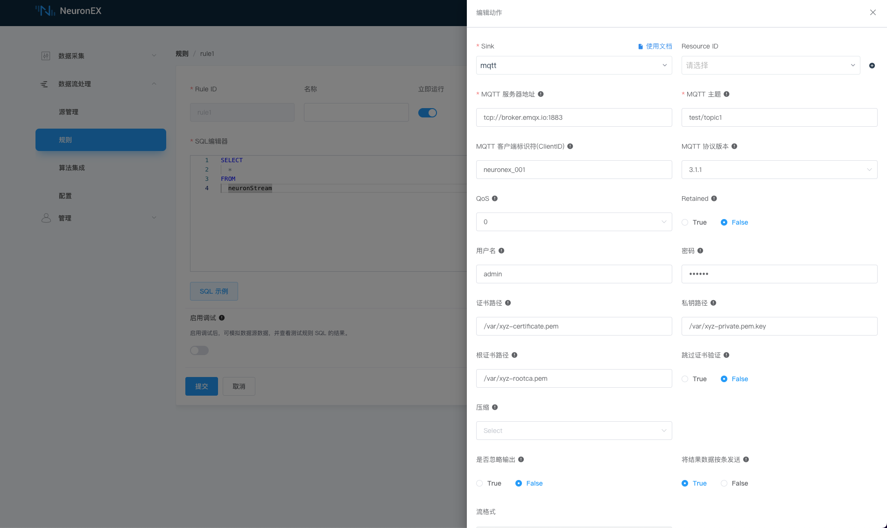

# MQTT Sink

该操作用于将输出消息发布到 MQTT 服务器中。
如希望使用 MQTT Sink 连接器，点击 **数据处理** -> **规则** -> **新建规则**，在 **动作** 区域，点击**添加**，**Sink** 选择 **MQTT**。

## 传输与存储配置

在弹出的页面，进行如下设置：

::: tip
如希望将传输与存储设置保存为模版，也可点击 **添加传输与存储模版** 在弹出的窗口中进行设置。新添加的模版将自动添加到**传输与存储模版**列表，您可点击 **数据处理** -> **配置** -> **资源** 的 **传输与存储模版** 查看或编辑已有的传输与存储模版。
:::

- **名称**：输入名称
- **MQTT 服务器地址**：MQTT 消息代理的服务器，如 `tcp://127.0.0.1:1883`
- **MQTT 主题**：将要订阅的 MQTT 主题， 例如 topic1。
- **MQTT 客户端标志符（ClientID）**：MQTT 连接的客户端 ID。 如果未指定，将使用一个 uuid。
- **MQTT 协议版本**：MQTT 协议版本，支持 3.1 或者 3.1.1 ，默认为 3.1.1。
- **QoS 级别**：默认 QoS 级别为0，可选值：0、1、2。 
- **retained**：如果 retained 设置为 true,Broker会存储每个 Topic 的最后一条保留消息及其 Qos。默认值是 false。
- **用户名**：可选参数，MQTT 连接用户名。
- **密码**：可选参数，MQTT 连接密码。
- **证书路径**：可选参数，填写证书路径，可以为绝对路径，也可以为相对路径。如果指定的是相对路径，那么父目录为执行 neuronex 命令的路径。示例值：`/var/xyz-certificate.pem`。
- **私钥路径**：可选参数，可以为绝对路径，也可以为相对路径。示例值：`/var/xyz-private.pem.key`。
- **根证书路径**：可选参数，用以验证服务器证书。可以为绝对路径，也可以为相对路径。示例值：`/var/xyz-rootca.pem`。
- **跳过证书验证**：默认为 False。如设置为 True，将跳过证书认证，否则进行证书验证。
- **压缩**：默认留空为不解压缩。使用指定的压缩方法解压缩 MQTT Payload，可选值：zlib、gzip、flate。
- **是否忽略输出**：默认为 False。
- **将结果数据按条发送**：默认为 True。
- **流格式**：支持 json、binary、protobuf、delimited、custom。默认 json 格式。
  - 如选择 protobuf 或 custom，还应配置对应的[模式和模式消息](../config.md#模式)
  - 如选择 delimited，还应配置分隔符，如 "`,`"
- **数据模版**：Golang 模板，用于指定输出数据格式。如不指定数据模板，则将数据作为原始输入。关于数据模版的详细介绍，见 [数据模版](./data_template.md)。

完成设置后，可点击**测试连接**确认连接情况。最后点击**提交**，完成设置。

## 示例

以下为使用 MQTT Sink 连接到 EMQX 的样例。

## MQTT 动态主题

若结果数据中包含主题内容，可以将其作为主题属性，从而实现 MQTT 动态主题的需求。假设 SQL 选出的数据包含 `mytopic`, 则可以使用数据模板的语法将其设置为 `topic` 属性的值，如下所示：

