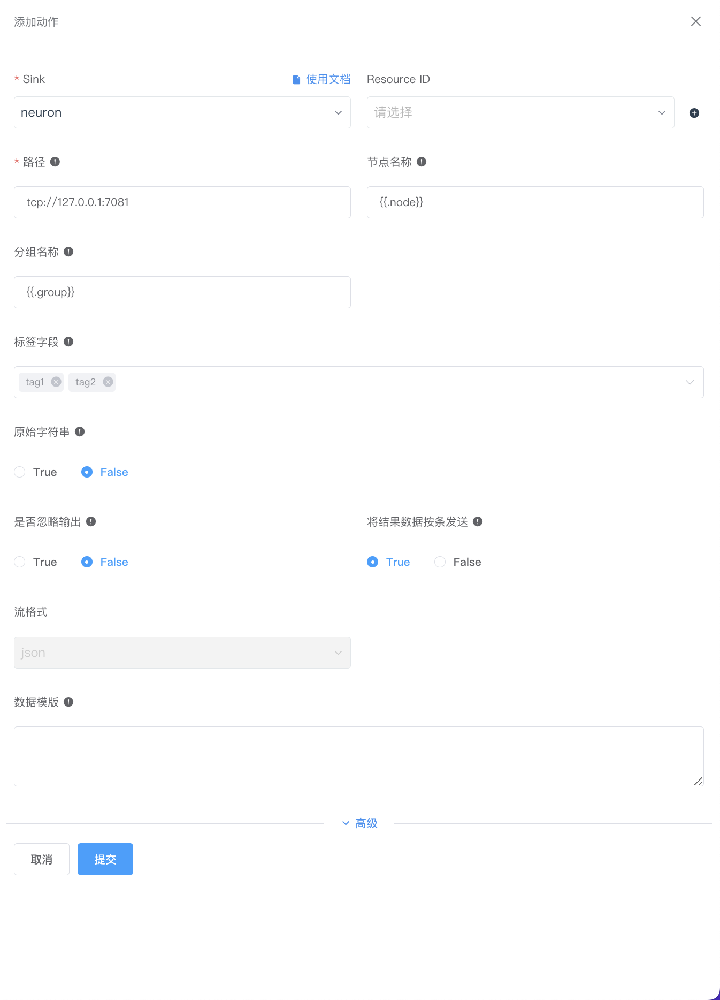
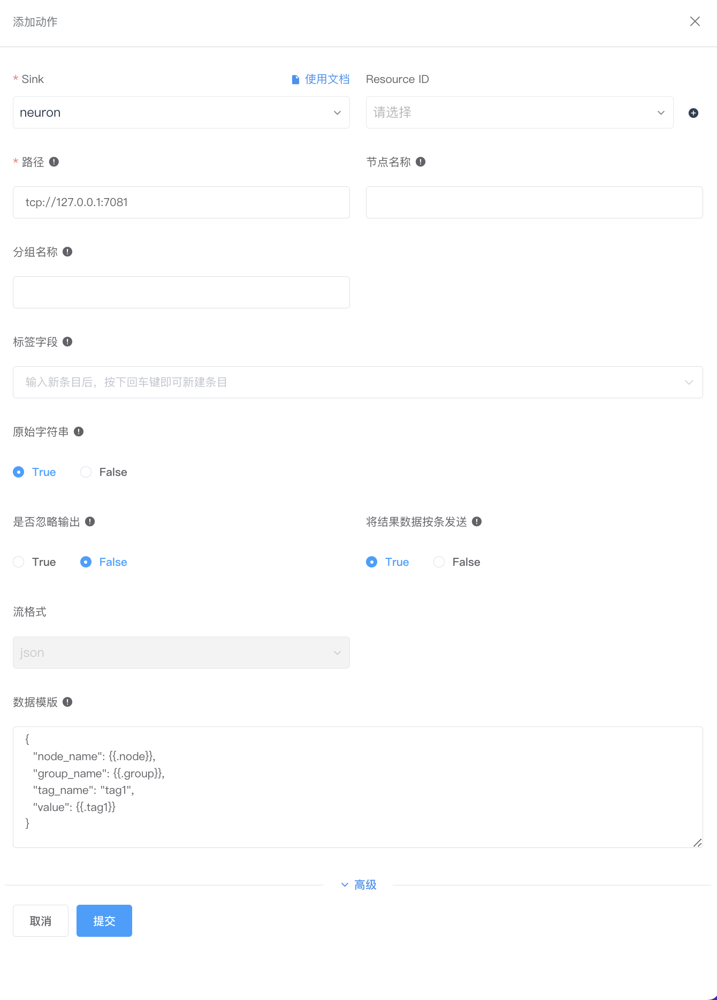

# Neuron Sink

该动作用于将结果发送到 NeuronEX 实例的数采模块中以实现设备反控。

如希望使用 Neuron Sink 连接器，点击 **数据处理** -> **规则** -> **新建规则**，在 **动作** 区域，点击**添加**，**Sink** 选择 **Neuron**。

## 传输与存储配置

在弹出的页面，进行如下设置：

::: tip
如希望将传输与存储设置保存为模版，也可点击 **添加传输与存储模版** 在弹出的窗口中进行设置。新添加的模版将自动添加到**传输与存储模版**列表，您可点击 **数据处理** -> **配置** -> **资源** 的 **传输与存储模版** 查看或编辑已有的传输与存储模版。
:::

- **名称**：输入名称
- **路径**：连接 NeuronEX 实例的数采模块的 URL，默认为 `tcp://127.0.0.1:7081`
- **节点名称**：发送到数采模块南向驱动的节点名称，值可以为动态参数模板。`原始字符串`配置项为`False`时,必须配置此选项。
- **分组名称**：发送到数采模块南向驱动的组名，值可以为动态参数模板。`原始字符串`配置项为`False`时,必须配置此选项。
- **标签字段**：发送到数采模块南向驱动的具体标签名称。标签应为规则处理后的字段名。
- **原始字符串**：该配置项为`False`时,通过`节点名称`、`分组名称`和`标签字段`进行数据写入。该配置项为`True`时,通过`数据模版`进行数据写入。
- **是否忽略输出**：默认为 False。
- **将结果数据按条发送**：默认为 True。
- **流格式**：默认为 `json`。
- **数据模版**：Golang 模板，用于指定输出数据格式。如不指定数据模板，则将数据作为原始输入。关于数据模版的详细介绍，见 [数据模版](./data_template.md)

完成设置后，可点击**测试连接**确认连接情况。最后点击**提交**，完成设置。

## 示例

假设接收到的结果如下所示：

```json
{
  "tag1": 25.2,
  "tag2": 72,
  "group": "group5",
  "node": "node5"
}
```

### 发送选定的标签

发送两个标签 tag1 和 tag2 到 node1 节点 group1 组。


:::tip 注意
在 NeuronEX 数采模块必须存在 node1 节点 group1 组，以及命名为 tag1 和 tag2 的两个数据标签，才会下发成功。
::: 

### 使用动态模板发送到动态的节点

使用动态模板发送两个标签 tag1 和 tag2 到 node5 节点 group5 组。



:::tip 注意
在 NeuronEX 数采模块必须存在 node5 节点 group5 组，以及命名为 tag1 和 tag2 的两个数据标签，才会下发成功。
::: 


### 使用原始字符串发送标签数据

使用原始字符串，发送一个标签 tag1 到 node5 节点 group5 组。



数据模板内容如下：
  
  ```json
{
  "node_name": {{.node}},
  "group_name": {{.group}},
  "tag_name": "tag1",
  "value": {{.tag1}}
}
  ```

:::tip 注意
使用原始字符串发送标签数据，目前仅支持写入单个点位标签。  
::: 