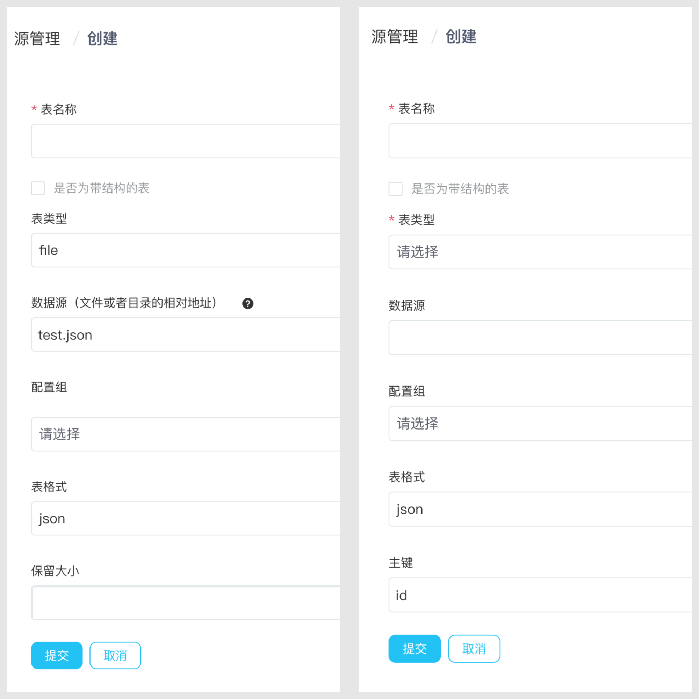

# 表

表是保留较为大量的状态的方法，NeuronEX 目前支持`扫描表(Scan Table)`、`查询表(Lookup Table)`两种类型的表。这两种类型的表都适用于流式批量综合计算。

- 扫描表（Scan Table）

    `扫描表`在内存中保存状态数据。它适用于较小的数据集，表的内容不需要在规则之间共享。`扫描表`像一个由事件驱动的流一样，一个一个地加载数据事件。大部分数据源即可以配置为`流`，也可以配置为`扫描表`。
- 查询表（Lookup Table）

    `查询表`绑定外部数据（比如 SQL 数据库中的数据）并在需要时查询引用外部数据。它适用于更大的数据集，并且在规则之间共享表的内容。

:::tip 提示
如采用流数据源，任何新数据都会附加到当前流中进行处理。表 （**Table**） 用于表示流的当前状态。它可以被认为是流的快照。用户可以使用表来保留一批数据进行处理。
:::

## 表数据源

| 名称                        | 描述                                    | 扫描表 | 查询表 |
| --------------------------- | ----------------------------------  | ------ | ------ |
| [Neuron](./neuron.md)       | 从 NeuronEX 数采模块读取数据             | ✅      |❌    |
| [MQTT](./mqtt.md)           | 从 MQTT 主题读取数据                         | ✅    | ❌    |
| [HTTP pull](./http_pull.md) | 从 HTTP 服务器中拉取数据                      | ✅    | ❌    |
| [HTTP push](./http_push.md) | 通过 HTTP 客户端推送数据到 NeuronEX        | ✅   | ❌     |
| [内存](./memory.md)         | 从 NeuronEX 内存主题读取数据以形成规则流水线   | ✅      | ✅     |
| [SQL](./sql.md)         | 从数据库中查询数据                          | ✅      | ✅|
| [文件](./file.md)           | 从文件中读取数据                             | ✅    | ❌    |
| [Video](./video.md)         | 从视频流中查询数据                       | ✅   | ❌    |
| [Simulator](./simulator.md)         | 生成模拟数据供测试                 | ✅    | ❌   | ❌    |
| [Redis](./redis.md)         | 从 Redis 读取数据                      |  ❌   |  ✅   |

## 创建表

在 NeuronEX 页面，点击**数据处理** -> **源管理**，在**扫描表**/**查询表**页签，点击**创建扫描表/创建查询表**按钮即可进行表的创建。

表的数据类型与属性与流一致，具体看可参考[流管理](./stream.md)页面。

因此，表也支持所有源类型。许多源不是批处理的，它们在任何给定时间点都有一个事件，这意味着表将始终只有一个事件。

在创建`扫描表`时，可通过**保留大小**（`RETAIN_SIZE`） 来指定表快照的大小，用于存储历史数据。

在创建`查询表`时，可以设置表的**主键**。例如，对于 SQL 源，用于指定 SQL 表中的主键。

## 应用场景

表是保留较为大量的状态的方法。扫描表将状态保存在内存中，而查找表将它们保存在外部，并可能是持久化的。扫描表更容易设置，而查找表可以很容易地连接到存在的持久化的状态。这两种类型都适用于流式批量综合计算。

请查看以下链接，了解一些典型场景。

- [扫描表使用场景](scan.md)
- [查找表使用场景](lookup.md)